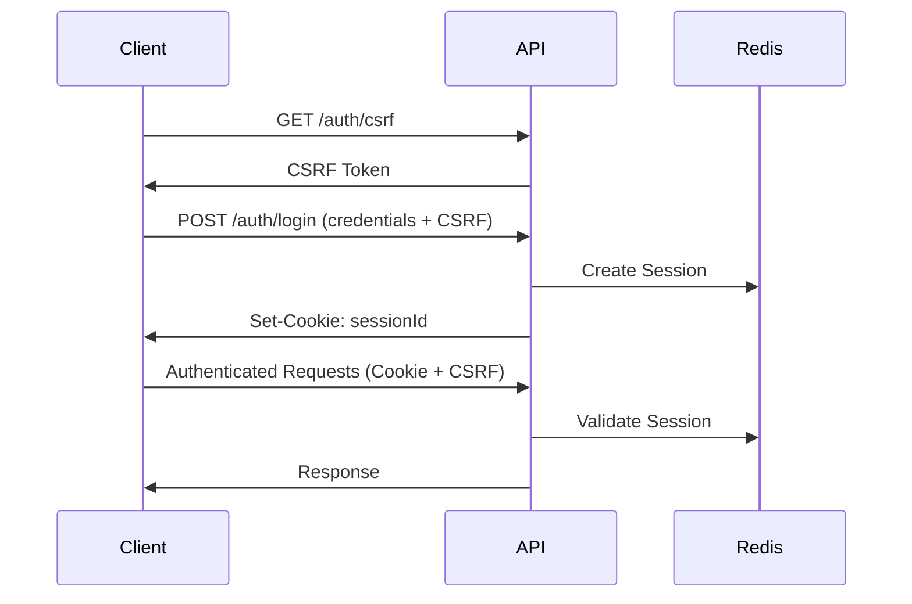

# API Documentation

## Overview

This document provides comprehensive documentation for the Angular + NestJS Authentication System API.

**Base URL:** `http://localhost:3000` (Development)  
**Production URL:** `https://api.yourdomain.com`

**API Version:** 1.0.0  
**Authentication:** Session-based with CSRF protection

---

## Table of Contents

- [Authentication](#authentication)
- [Endpoints](#endpoints)
  - [Auth Endpoints](#auth-endpoints)
  - [User Endpoints](#user-endpoints)
  - [Session Endpoints](#session-endpoints)
- [Error Handling](#error-handling)
- [Rate Limiting](#rate-limiting)
- [Security](#security)

---

## Authentication

### Session-Based Authentication

The API uses session-based authentication with HTTP-only cookies and CSRF protection.

**Authentication Flow:**



**Required Headers:**

```http
Content-Type: application/json
X-CSRF-Token: <csrf-token>
Cookie: sessionId=<session-id>
```

---

## Endpoints

### Auth Endpoints

#### 1. Get CSRF Token

Get a CSRF token required for state-changing operations.

**Endpoint:** `GET /auth/csrf`

**Authentication:** Not required

**Request:**
```http
GET /auth/csrf HTTP/1.1
Host: localhost:3000
```

**Response:**
```json
{
  "csrfToken": "a1b2c3d4-e5f6-7890-abcd-ef1234567890"
}
```

**Status Codes:**
- `200 OK` - CSRF token generated successfully

**Example (cURL):**
```bash
curl -X GET http://localhost:3000/auth/csrf \
  -H "Content-Type: application/json"
```

**Example (JavaScript):**
```javascript
const response = await fetch('http://localhost:3000/auth/csrf', {
  method: 'GET',
  credentials: 'include'
});
const { csrfToken } = await response.json();
```

---

#### 2. Login

Authenticate a user and create a session.

**Endpoint:** `POST /auth/login`

**Authentication:** Not required (but CSRF token required)

**Request Headers:**
```http
Content-Type: application/json
X-CSRF-Token: <csrf-token>
```

**Request Body:**
```json
{
  "username": "testuser",
  "password": "Test123!@#"
}
```

**Validation Rules:**
- `username`: Required, string, 3-50 characters
- `password`: Required, string, 8-100 characters

**Response (Success):**
```json
{
  "message": "Login successful",
  "user": {
    "id": 1,
    "username": "testuser",
    "email": "test@example.com",
    "createdAt": "2026-05-27T10:00:00.000Z"
  }
}
```

**Response (Failure):**
```json
{
  "statusCode": 401,
  "message": "Invalid credentials",
  "error": "Unauthorized"
}
```

**Status Codes:**
- `200 OK` - Login successful
- `400 Bad Request` - Invalid input
- `401 Unauthorized` - Invalid credentials
- `403 Forbidden` - Invalid or missing CSRF token
- `429 Too Many Requests` - Rate limit exceeded

**Example (cURL):**
```bash
curl -X POST http://localhost:3000/auth/login \
  -H "Content-Type: application/json" \
  -H "X-CSRF-Token: a1b2c3d4-e5f6-7890-abcd-ef1234567890" \
  -d '{
    "username": "testuser",
    "password": "Test123!@#"
  }' \
  -c cookies.txt
```

**Example (JavaScript):**
```javascript
const response = await fetch('http://localhost:3000/auth/login', {
  method: 'POST',
  headers: {
    'Content-Type': 'application/json',
    'X-CSRF-Token': csrfToken
  },
  credentials: 'include',
  body: JSON.stringify({
    username: 'testuser',
    password: 'Test123!@#'
  })
});
const data = await response.json();
```

---

#### 3. Logout

End the current session.

**Endpoint:** `POST /auth/logout`

**Authentication:** Required

**Request Headers:**
```http
X-CSRF-Token: <csrf-token>
Cookie: sessionId=<session-id>
```

**Response:**
```json
{
  "message": "Logout successful"
}
```

**Status Codes:**
- `200 OK` - Logout successful
- `401 Unauthorized` - Not authenticated
- `403 Forbidden` - Invalid CSRF token

**Example (cURL):**
```bash
curl -X POST http://localhost:3000/auth/logout \
  -H "X-CSRF-Token: a1b2c3d4-e5f6-7890-abcd-ef1234567890" \
  -b cookies.txt
```

---

#### 4. Get Current User

Get the currently authenticated user's information.

**Endpoint:** `GET /auth/me`

**Authentication:** Required

**Request Headers:**
```http
Cookie: sessionId=<session-id>
```

**Response:**
```json
{
  "id": 1,
  "username": "testuser",
  "email": "test@example.com",
  "createdAt": "2026-05-27T10:00:00.000Z"
}
```

**Status Codes:**
- `200 OK` - User information retrieved
- `401 Unauthorized` - Not authenticated

**Example (cURL):**
```bash
curl -X GET http://localhost:3000/auth/me \
  -b cookies.txt
```

---

#### 5. Check Session Status

Check if the current session is valid.

**Endpoint:** `GET /auth/status`

**Authentication:** Required

**Response:**
```json
{
  "authenticated": true,
  "user": {
    "id": 1,
    "username": "testuser"
  },
  "sessionExpiry": "2026-05-27T10:30:00.000Z"
}
```

**Status Codes:**
- `200 OK` - Session is valid
- `401 Unauthorized` - Session is invalid or expired

---

### User Endpoints

#### 1. Create User

Register a new user account.

**Endpoint:** `POST /users`

**Authentication:** Not required (but CSRF token required)

**Request Headers:**
```http
Content-Type: application/json
X-CSRF-Token: <csrf-token>
```

**Request Body:**
```json
{
  "username": "newuser",
  "email": "newuser@example.com",
  "password": "SecurePass123!@#"
}
```

**Validation Rules:**
- `username`: Required, 3-50 characters, alphanumeric + underscore
- `email`: Required, valid email format
- `password`: Required, 8-100 characters, must contain uppercase, lowercase, number, special character

**Response:**
```json
{
  "id": 2,
  "username": "newuser",
  "email": "newuser@example.com",
  "createdAt": "2026-05-27T10:00:00.000Z"
}
```

**Status Codes:**
- `201 Created` - User created successfully
- `400 Bad Request` - Invalid input
- `403 Forbidden` - Invalid CSRF token
- `409 Conflict` - Username or email already exists

**Example (cURL):**
```bash
curl -X POST http://localhost:3000/users \
  -H "Content-Type: application/json" \
  -H "X-CSRF-Token: a1b2c3d4-e5f6-7890-abcd-ef1234567890" \
  -d '{
    "username": "newuser",
    "email": "newuser@example.com",
    "password": "SecurePass123!@#"
  }'
```

---

#### 2. Get All Users

Retrieve a list of all users (admin only).

**Endpoint:** `GET /users`

**Authentication:** Required (Admin role)

**Query Parameters:**
- `page` (optional): Page number (default: 1)
- `limit` (optional): Items per page (default: 10)

**Response:**
```json
{
  "data": [
    {
      "id": 1,
      "username": "testuser",
      "email": "test@example.com",
      "createdAt": "2026-05-27T10:00:00.000Z"
    }
  ],
  "total": 1,
  "page": 1,
  "limit": 10
}
```

**Status Codes:**
- `200 OK` - Users retrieved successfully
- `401 Unauthorized` - Not authenticated
- `403 Forbidden` - Insufficient permissions

---

#### 3. Get User by ID

Retrieve a specific user's information.

**Endpoint:** `GET /users/:id`

**Authentication:** Required

**Path Parameters:**
- `id`: User ID (integer)

**Response:**
```json
{
  "id": 1,
  "username": "testuser",
  "email": "test@example.com",
  "createdAt": "2026-05-27T10:00:00.000Z"
}
```

**Status Codes:**
- `200 OK` - User found
- `401 Unauthorized` - Not authenticated
- `404 Not Found` - User not found

---

#### 4. Update User

Update user information.

**Endpoint:** `PATCH /users/:id`

**Authentication:** Required (Own account or Admin)

**Request Headers:**
```http
Content-Type: application/json
X-CSRF-Token: <csrf-token>
Cookie: sessionId=<session-id>
```

**Request Body:**
```json
{
  "email": "newemail@example.com"
}
```

**Response:**
```json
{
  "id": 1,
  "username": "testuser",
  "email": "newemail@example.com",
  "updatedAt": "2026-05-27T11:00:00.000Z"
}
```

**Status Codes:**
- `200 OK` - User updated successfully
- `400 Bad Request` - Invalid input
- `401 Unauthorized` - Not authenticated
- `403 Forbidden` - Insufficient permissions or invalid CSRF
- `404 Not Found` - User not found

---

#### 5. Delete User

Delete a user account.

**Endpoint:** `DELETE /users/:id`

**Authentication:** Required (Own account or Admin)

**Request Headers:**
```http
X-CSRF-Token: <csrf-token>
Cookie: sessionId=<session-id>
```

**Response:**
```json
{
  "message": "User deleted successfully"
}
```

**Status Codes:**
- `200 OK` - User deleted successfully
- `401 Unauthorized` - Not authenticated
- `403 Forbidden` - Insufficient permissions or invalid CSRF
- `404 Not Found` - User not found

---

## Error Handling

### Error Response Format

All errors follow a consistent format:

```json
{
  "statusCode": 400,
  "message": "Validation failed",
  "error": "Bad Request",
  "details": [
    {
      "field": "password",
      "message": "password must be longer than or equal to 8 characters"
    }
  ]
}
```

### Common Error Codes

| Status Code | Error | Description |
|-------------|-------|-------------|
| 400 | Bad Request | Invalid input or validation error |
| 401 | Unauthorized | Authentication required or invalid credentials |
| 403 | Forbidden | Insufficient permissions or invalid CSRF token |
| 404 | Not Found | Resource not found |
| 409 | Conflict | Resource already exists |
| 429 | Too Many Requests | Rate limit exceeded |
| 500 | Internal Server Error | Server error |

---

## Rate Limiting

The API implements rate limiting to prevent abuse:

### Rate Limit Tiers

| Endpoint Type | Limit | Window |
|---------------|-------|--------|
| Authentication | 5 requests | 15 minutes |
| General API | 100 requests | 15 minutes |
| Public | 20 requests | 1 minute |

### Rate Limit Headers

```http
X-RateLimit-Limit: 100
X-RateLimit-Remaining: 95
X-RateLimit-Reset: 1622547600
```

### Rate Limit Exceeded Response

```json
{
  "statusCode": 429,
  "message": "Too Many Requests",
  "error": "ThrottlerException"
}
```

---

## Security

### CSRF Protection

All state-changing operations (POST, PUT, PATCH, DELETE) require a CSRF token:

1. Get CSRF token: `GET /auth/csrf`
2. Include token in header: `X-CSRF-Token: <token>`

### Session Security

- **HTTP-Only Cookies**: Prevents XSS attacks
- **Secure Flag**: HTTPS only in production
- **SameSite**: Strict CSRF protection
- **Session Expiry**: 30 minutes of inactivity

### Password Requirements

- Minimum 8 characters
- At least one uppercase letter
- At least one lowercase letter
- At least one number
- At least one special character

### CORS Policy

- Credentials allowed
- Specific origin whitelist
- No wildcard origins in production

---

## Testing the API

### Using cURL

```bash
# 1. Get CSRF token
CSRF_TOKEN=$(curl -s http://localhost:3000/auth/csrf | jq -r '.csrfToken')

# 2. Login
curl -X POST http://localhost:3000/auth/login \
  -H "Content-Type: application/json" \
  -H "X-CSRF-Token: $CSRF_TOKEN" \
  -d '{"username":"testuser","password":"Test123!@#"}' \
  -c cookies.txt

# 3. Get current user
curl -X GET http://localhost:3000/auth/me \
  -b cookies.txt

# 4. Logout
curl -X POST http://localhost:3000/auth/logout \
  -H "X-CSRF-Token: $CSRF_TOKEN" \
  -b cookies.txt
```

### Using Postman

1. **Import Collection**: Use the provided Postman collection
2. **Set Environment**: Configure base URL and variables
3. **Get CSRF Token**: Run the CSRF endpoint first
4. **Login**: Use the login endpoint with CSRF token
5. **Authenticated Requests**: Cookies are automatically handled

### Using JavaScript/Fetch

```javascript
// Complete authentication flow
async function authenticateAndFetch() {
  // 1. Get CSRF token
  const csrfResponse = await fetch('http://localhost:3000/auth/csrf', {
    credentials: 'include'
  });
  const { csrfToken } = await csrfResponse.json();
  
  // 2. Login
  const loginResponse = await fetch('http://localhost:3000/auth/login', {
    method: 'POST',
    headers: {
      'Content-Type': 'application/json',
      'X-CSRF-Token': csrfToken
    },
    credentials: 'include',
    body: JSON.stringify({
      username: 'testuser',
      password: 'Test123!@#'
    })
  });
  
  // 3. Make authenticated request
  const userResponse = await fetch('http://localhost:3000/auth/me', {
    credentials: 'include'
  });
  const user = await userResponse.json();
  
  return user;
}
```

---

## Support

For issues or questions:
- Check the [Troubleshooting Guide](TROUBLESHOOTING_504_ERROR.md)
- Review the [Deployment Guide](DEPLOYMENT_GUIDE.md)
- Check the [Security Documentation](SECURITY_DOCUMENTATION.md)

---

**Made with Bob**