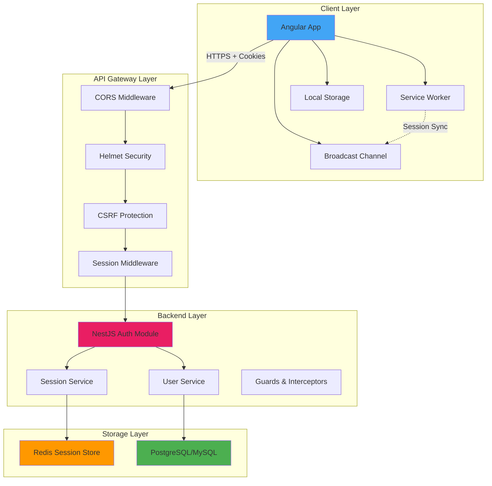
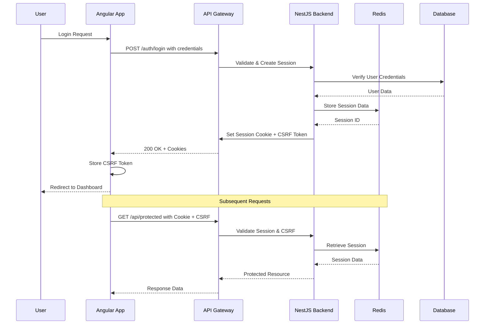
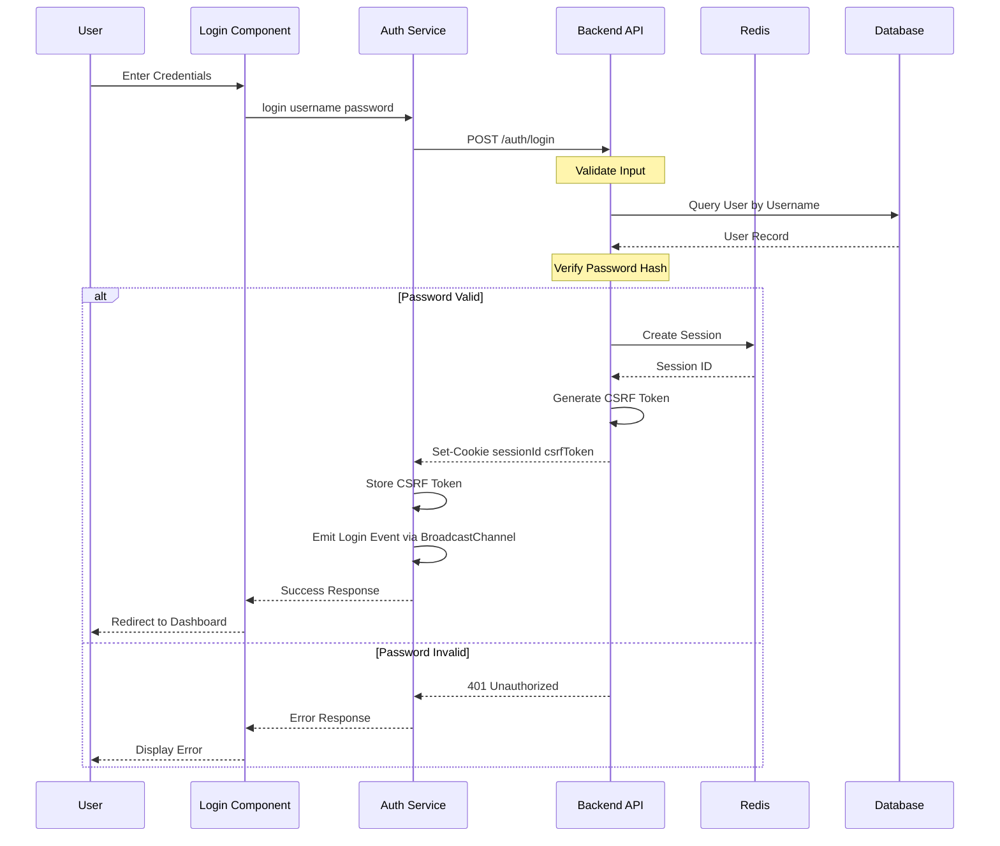
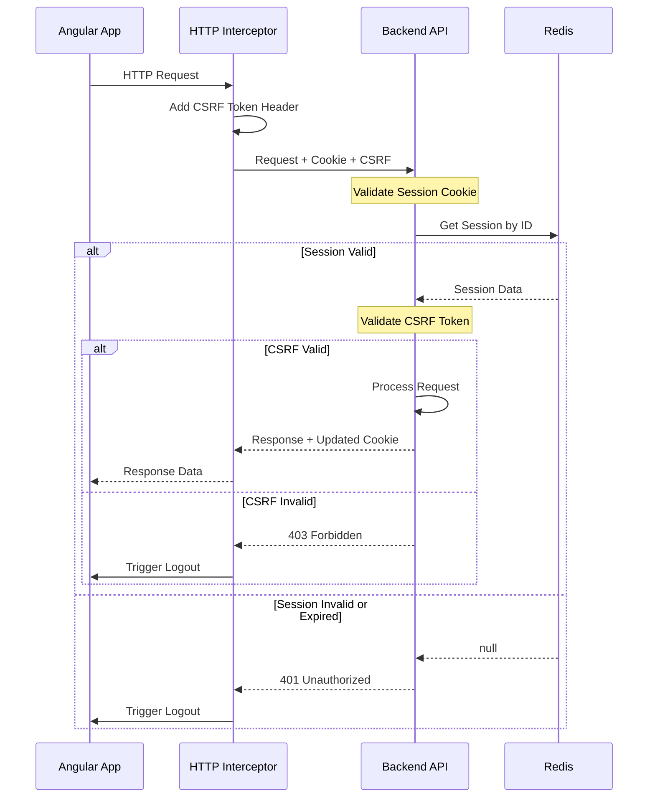
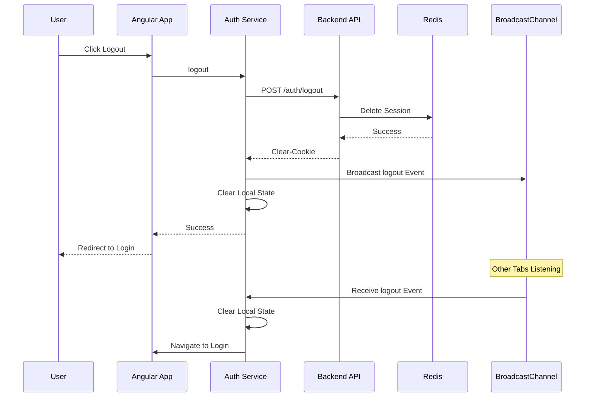
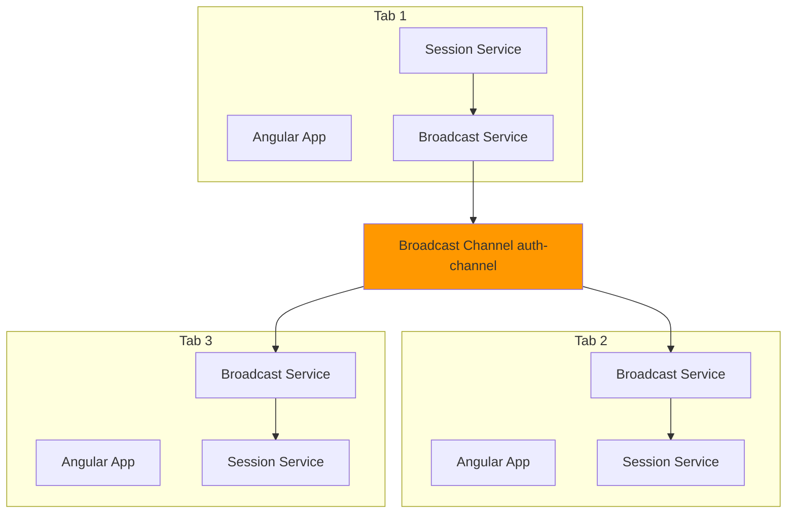
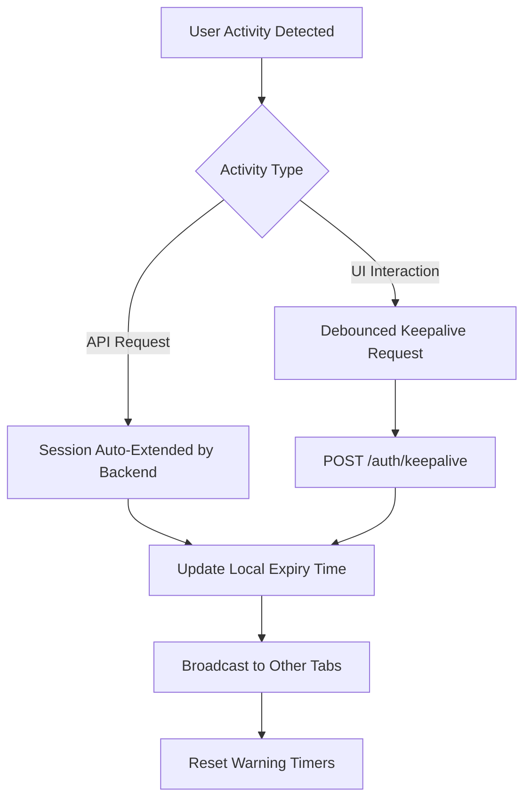
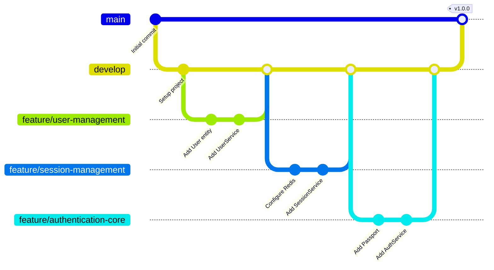

# Angular + NestJS Authentication System - Technical Specification

## Table of Contents
1. [Executive Summary](#executive-summary)
2. [Architecture Overview](#architecture-overview)
3. [Technology Stack](#technology-stack)
4. [Project Structure](#project-structure)
5. [Authentication Flow](#authentication-flow)
6. [Session Management Strategy](#session-management-strategy)
7. [Token Management](#token-management)
8. [CSRF Protection](#csrf-protection)
9. [Cross-Tab Synchronization](#cross-tab-synchronization)
10. [Session Keepalive & Expiry Warning](#session-keepalive--expiry-warning)
11. [Iframe Session Validation](#iframe-session-validation)
12. [Security Considerations](#security-considerations)
13. [CORS Configuration](#cors-configuration)
14. [Implementation Phases](#implementation-phases)
15. [Git Workflow Strategy](#git-workflow-strategy)
16. [Testing Strategy](#testing-strategy)
17. [Deployment Considerations](#deployment-considerations)

---

## Executive Summary

This document outlines the technical specification for a production-ready authentication system built with Angular (frontend) and NestJS (backend). The system implements **stateful session management** with server-side sessions stored in Redis, providing robust security through CSRF protection, cross-tab synchronization, and comprehensive session lifecycle management.

### Key Design Decisions

**Why Stateful Sessions?**
- **Enhanced Security**: Session data stored server-side prevents client-side tampering
- **Immediate Revocation**: Sessions can be invalidated instantly across all devices
- **Reduced Token Exposure**: No sensitive data in client-side storage
- **Audit Trail**: Centralized session tracking for security monitoring

**Why Redis for Session Storage?**
- **Performance**: In-memory storage provides sub-millisecond session lookups
- **Scalability**: Supports horizontal scaling across multiple backend instances
- **TTL Support**: Built-in expiration mechanism for automatic session cleanup
- **Persistence Options**: Configurable persistence for disaster recovery

---

## Architecture Overview

### High-Level Architecture



### Component Interaction Flow



---

## Technology Stack

### Backend Stack
| Technology | Version | Purpose | Why This Choice |
|------------|---------|---------|-----------------|
| **NestJS** | ^10.0.0 | Backend Framework | TypeScript-first, modular architecture, built-in dependency injection |
| **Express** | ^4.18.0 | HTTP Server | Mature ecosystem, extensive middleware support |
| **express-session** | ^1.17.3 | Session Management | Industry standard, Redis integration, secure defaults |
| **connect-redis** | ^7.1.0 | Redis Session Store | Official Redis adapter, connection pooling |
| **ioredis** | ^5.3.0 | Redis Client | High performance, cluster support, TypeScript types |
| **Passport** | ^0.6.0 | Authentication | Flexible strategy system, extensive ecosystem |
| **csurf** | ^1.11.0 | CSRF Protection | Token-based protection, Express integration |
| **Helmet** | ^7.0.0 | Security Headers | Comprehensive HTTP header security |
| **bcrypt** | ^5.1.0 | Password Hashing | Industry standard, configurable work factor |
| **class-validator** | ^0.14.0 | Input Validation | Decorator-based, TypeScript integration |

### Frontend Stack
| Technology | Version | Purpose | Why This Choice |
|------------|---------|---------|-----------------|
| **Angular** | ^17.0.0 | Frontend Framework | Enterprise-ready, TypeScript native, comprehensive tooling |
| **RxJS** | ^7.8.0 | Reactive Programming | Built-in Angular support, powerful operators |
| **Angular Material** | ^17.0.0 | UI Components | Consistent design, accessibility built-in |
| **HttpClient** | Built-in | HTTP Communication | Interceptor support, Observable-based |

### Infrastructure
| Technology | Purpose | Why This Choice |
|------------|---------|-----------------|
| **Redis** | Session Store | In-memory performance, persistence options, pub/sub for scaling |
| **PostgreSQL/MySQL** | User Database | ACID compliance, relational integrity, mature ecosystem |
| **Docker** | Containerization | Consistent environments, easy deployment |
| **Nginx** | Reverse Proxy | Load balancing, SSL termination, static file serving |

---

## Project Structure

### Backend Structure (NestJS)

```
backend/
├── src/
│   ├── main.ts                          # Application entry point
│   ├── app.module.ts                    # Root module
│   │
│   ├── auth/                            # Authentication module
│   │   ├── auth.module.ts
│   │   ├── auth.controller.ts           # Login, logout, session endpoints
│   │   ├── auth.service.ts              # Authentication logic
│   │   ├── strategies/
│   │   │   └── local.strategy.ts        # Passport local strategy
│   │   ├── guards/
│   │   │   ├── authenticated.guard.ts   # Session validation guard
│   │   │   └── csrf.guard.ts            # CSRF validation guard
│   │   ├── decorators/
│   │   │   ├── current-user.decorator.ts
│   │   │   └── public.decorator.ts
│   │   └── dto/
│   │       ├── login.dto.ts
│   │       └── session-info.dto.ts
│   │
│   ├── session/                         # Session management module
│   │   ├── session.module.ts
│   │   ├── session.service.ts           # Session CRUD operations
│   │   ├── session.controller.ts        # Session endpoints
│   │   ├── redis/
│   │   │   ├── redis.module.ts
│   │   │   └── redis.service.ts         # Redis connection management
│   │   └── interfaces/
│   │       └── session-data.interface.ts
│   │
│   ├── users/                           # User management module
│   │   ├── users.module.ts
│   │   ├── users.service.ts
│   │   ├── users.controller.ts
│   │   ├── entities/
│   │   │   └── user.entity.ts
│   │   └── dto/
│   │       ├── create-user.dto.ts
│   │       └── update-user.dto.ts
│   │
│   ├── common/                          # Shared utilities
│   │   ├── filters/
│   │   │   └── http-exception.filter.ts
│   │   ├── interceptors/
│   │   │   ├── logging.interceptor.ts
│   │   │   └── timeout.interceptor.ts
│   │   ├── middleware/
│   │   │   ├── cors.middleware.ts
│   │   │   ├── helmet.middleware.ts
│   │   │   └── session.middleware.ts
│   │   └── constants/
│   │       └── session.constants.ts
│   │
│   └── config/                          # Configuration
│       ├── configuration.ts             # Environment config
│       ├── session.config.ts            # Session configuration
│       ├── redis.config.ts              # Redis configuration
│       └── cors.config.ts               # CORS configuration
│
├── test/                                # E2E tests
├── .env.example                         # Environment template
├── .env.development
├── .env.production
├── nest-cli.json
├── package.json
├── tsconfig.json
└── docker-compose.yml                   # Redis + DB setup
```

### Frontend Structure (Angular)

```
frontend/
├── src/
│   ├── app/
│   │   ├── app.component.ts
│   │   ├── app.module.ts
│   │   ├── app-routing.module.ts
│   │   │
│   │   ├── core/                        # Singleton services
│   │   │   ├── core.module.ts
│   │   │   ├── auth/
│   │   │   │   ├── auth.service.ts      # Authentication logic
│   │   │   │   ├── session.service.ts   # Session management
│   │   │   │   ├── csrf.service.ts      # CSRF token handling
│   │   │   │   └── auth.guard.ts        # Route protection
│   │   │   ├── interceptors/
│   │   │   │   ├── auth.interceptor.ts  # Add auth headers
│   │   │   │   ├── csrf.interceptor.ts  # Add CSRF token
│   │   │   │   └── error.interceptor.ts # Handle auth errors
│   │   │   └── services/
│   │   │       ├── storage.service.ts   # Local storage wrapper
│   │   │       └── broadcast.service.ts # Cross-tab communication
│   │   │
│   │   ├── shared/                      # Shared components
│   │   │   ├── shared.module.ts
│   │   │   ├── components/
│   │   │   │   ├── session-warning-dialog/
│   │   │   │   │   ├── session-warning-dialog.component.ts
│   │   │   │   │   ├── session-warning-dialog.component.html
│   │   │   │   │   └── session-warning-dialog.component.scss
│   │   │   │   └── loading-spinner/
│   │   │   └── directives/
│   │   │
│   │   ├── features/                    # Feature modules
│   │   │   ├── auth/
│   │   │   │   ├── auth.module.ts
│   │   │   │   ├── login/
│   │   │   │   │   ├── login.component.ts
│   │   │   │   │   ├── login.component.html
│   │   │   │   │   └── login.component.scss
│   │   │   │   └── logout/
│   │   │   │       └── logout.component.ts
│   │   │   │
│   │   │   └── dashboard/
│   │   │       ├── dashboard.module.ts
│   │   │       └── dashboard.component.ts
│   │   │
│   │   └── models/                      # TypeScript interfaces
│   │       ├── user.model.ts
│   │       ├── session.model.ts
│   │       └── auth-response.model.ts
│   │
│   ├── assets/
│   ├── environments/
│   │   ├── environment.ts
│   │   └── environment.prod.ts
│   └── index.html
│
├── angular.json
├── package.json
├── tsconfig.json
└── proxy.conf.json                      # Development proxy config
```


---

## Authentication Flow

### Login Flow



### Session Validation Flow



### Logout Flow



---

## Session Management Strategy

### Session Configuration

**Session Properties:**
```typescript
{
  name: 'sessionId',                    // Cookie name
  secret: process.env.SESSION_SECRET,   // Signing secret (rotate regularly)
  resave: false,                        // Don't save unchanged sessions
  saveUninitialized: false,             // Don't create sessions for unauthenticated users
  rolling: true,                        // Reset expiry on each request
  cookie: {
    httpOnly: true,                     // Prevent XSS access
    secure: true,                       // HTTPS only (production)
    sameSite: 'strict',                 // CSRF protection
    maxAge: 30 * 60 * 1000,            // 30 minutes
    domain: '.yourdomain.com',          // Allow subdomains
    path: '/'
  },
  store: new RedisStore({
    client: redisClient,
    prefix: 'sess:',
    ttl: 1800                           // 30 minutes in seconds
  })
}
```

### Why These Settings?

**`resave: false`**
- **Reason**: Prevents unnecessary writes to Redis
- **Impact**: Reduces Redis load and prevents race conditions in concurrent requests
- **Trade-off**: None - this is the recommended setting

**`saveUninitialized: false`**
- **Reason**: Complies with GDPR/privacy laws by not storing sessions for anonymous users
- **Impact**: Reduces storage costs and improves performance
- **Trade-off**: Must explicitly save session after authentication

**`rolling: true`**
- **Reason**: Extends session on user activity (sliding window)
- **Impact**: Better UX - active users don't get logged out
- **Trade-off**: Slightly more Redis writes, but worth it for UX

**`httpOnly: true`**
- **Reason**: Prevents JavaScript access to session cookie
- **Impact**: Mitigates XSS attacks - even if attacker injects script, they can't steal session
- **Trade-off**: None - this is essential security

**`secure: true`**
- **Reason**: Cookie only sent over HTTPS
- **Impact**: Prevents session hijacking on insecure networks
- **Trade-off**: Requires HTTPS (use `false` in development only)

**`sameSite: 'strict'`**
- **Reason**: Cookie not sent on cross-site requests
- **Impact**: Strong CSRF protection
- **Trade-off**: May break legitimate cross-site flows (use 'lax' if needed)

### Session Data Structure

```typescript
interface SessionData {
  userId: string;                       // User identifier
  username: string;                     // For display purposes
  roles: string[];                      // Authorization roles
  createdAt: number;                    // Session creation timestamp
  lastActivity: number;                 // Last request timestamp
  ipAddress: string;                    // Client IP (for security audit)
  userAgent: string;                    // Client user agent
  csrfSecret: string;                   // CSRF token secret
  metadata?: {                          // Optional metadata
    loginMethod?: 'password' | 'oauth';
    deviceId?: string;
    location?: string;
  };
}
```

### Session Lifecycle Management

**Creation:**
1. User authenticates successfully
2. Generate unique session ID (cryptographically secure)
3. Store session data in Redis with TTL
4. Set session cookie in response
5. Generate and return CSRF token

**Validation:**
1. Extract session ID from cookie
2. Query Redis for session data
3. Verify session hasn't expired
4. Validate CSRF token (for state-changing requests)
5. Update `lastActivity` timestamp
6. Extend TTL if `rolling: true`

**Destruction:**
1. User logs out explicitly
2. Session expires (TTL reached)
3. User logs in from another device (optional: single session per user)
4. Admin revokes session
5. Security event detected (suspicious activity)

### Redis Session Storage Strategy

**Key Structure:**
```
sess:${sessionId}  ->  JSON serialized session data
user:${userId}:sessions  ->  Set of active session IDs (for multi-device management)
```

**Why This Structure?**
- **Fast Lookups**: O(1) session retrieval by ID
- **User Session Management**: Can list/revoke all sessions for a user
- **Atomic Operations**: Redis transactions ensure consistency
- **Automatic Cleanup**: TTL handles expiration without manual intervention

**Redis Configuration:**
```typescript
{
  host: process.env.REDIS_HOST,
  port: parseInt(process.env.REDIS_PORT),
  password: process.env.REDIS_PASSWORD,
  db: 0,                                // Dedicated DB for sessions
  retryStrategy: (times) => {
    const delay = Math.min(times * 50, 2000);
    return delay;
  },
  maxRetriesPerRequest: 3,
  enableReadyCheck: true,
  lazyConnect: false
}
```

---

## Token Management

### Token Strategy Comparison

| Aspect | JWT Stateless | Session + CSRF Our Choice |
|--------|-----------------|----------------------------|
| **Storage** | Client-side localStorage or cookie | Server-side Redis |
| **Revocation** | Difficult requires blacklist | Immediate delete from Redis |
| **Payload Size** | Large contains claims | Small just session ID |
| **Security** | Vulnerable if stolen | Protected by httpOnly cookie |
| **Scalability** | Excellent no server state | Good Redis clustering |
| **Complexity** | Medium token refresh logic | Low session middleware |
| **CSRF Protection** | Required if in cookie | Built-in with CSRF tokens |
| **Best For** | Microservices APIs | Monolithic web apps |

### Why Session + CSRF Over JWT?

**Security Advantages:**
1. **Immediate Revocation**: Can invalidate sessions instantly (critical for security incidents)
2. **No Token Exposure**: Session ID is meaningless without Redis data
3. **HttpOnly Cookies**: JavaScript cannot access session cookie (XSS protection)
4. **Server-Side Control**: Full control over session lifecycle

**Operational Advantages:**
1. **Simpler Logic**: No token refresh mechanism needed
2. **Smaller Payloads**: Just session ID vs. full JWT
3. **Easier Debugging**: Can inspect sessions in Redis
4. **Audit Trail**: Centralized session tracking

**Trade-offs Accepted:**
1. **Redis Dependency**: Requires Redis availability (mitigated by clustering)
2. **Slightly Higher Latency**: Redis lookup on each request (sub-millisecond)
3. **Horizontal Scaling**: Requires sticky sessions or shared Redis (solved by Redis cluster)

### CSRF Token Implementation

**Token Generation:**
```typescript
// Backend generates CSRF token per session
const csrfSecret = crypto.randomBytes(32).toString('hex');
session.csrfSecret = csrfSecret;

// Token sent to client not in cookie
const csrfToken = crypto
  .createHmac('sha256', csrfSecret)
  .update(sessionId)
  .digest('hex');

response.json({ csrfToken });
```

**Token Validation:**
```typescript
// Client sends token in header
headers: {
  'X-CSRF-Token': csrfToken
}

// Backend validates
const expectedToken = crypto
  .createHmac('sha256', session.csrfSecret)
  .update(sessionId)
  .digest('hex');

if (receivedToken !== expectedToken) {
  throw new ForbiddenException('Invalid CSRF token');
}
```

**Why This Approach?**
- **Double Submit Cookie Alternative**: More secure than double-submit pattern
- **Session-Bound**: Token tied to specific session, can't be reused
- **Stateless Validation**: No need to store tokens separately
- **Rotation**: New token on each login

---

## CSRF Protection

### CSRF Attack Vector

**What is CSRF?**
Cross-Site Request Forgery tricks authenticated users into executing unwanted actions. Example:

```html
<!-- Malicious site -->

```

If user is logged in, browser automatically sends session cookie, executing the transfer.

### Our CSRF Protection Strategy

**Multi-Layer Defense:**

1. **SameSite Cookie Attribute**
   ```typescript
   cookie: {
     sameSite: 'strict'  // Browser won't send cookie on cross-site requests
   }
   ```
   - **Pros**: Simple, effective, no code needed
   - **Cons**: Not supported by all browsers (legacy)

2. **CSRF Token Validation**
   ```typescript
   // Required for state-changing operations POST PUT DELETE
   headers: {
     'X-CSRF-Token': csrfToken
   }
   ```
   - **Pros**: Works in all browsers, industry standard
   - **Cons**: Requires client-side implementation

3. **Origin/Referer Validation**
   ```typescript
   // Backend validates request origin
   const origin = request.headers.origin;
   const allowedOrigins = ['https://yourapp.com'];
   if (!allowedOrigins.includes(origin)) {
     throw new ForbiddenException();
   }
   ```
   - **Pros**: Additional layer of defense
   - **Cons**: Can be bypassed in some scenarios

### Implementation Details

**Backend CSRF Guard:**
```typescript
@Injectable()
export class CsrfGuard implements CanActivate {
  canActivate(context: ExecutionContext): boolean {
    const request = context.switchToHttp().getRequest();
    const method = request.method;
    
    // Only validate state-changing methods
    if (['GET', 'HEAD', 'OPTIONS'].includes(method)) {
      return true;
    }
    
    const csrfToken = request.headers['x-csrf-token'];
    const session = request.session;
    
    if (!csrfToken || !session?.csrfSecret) {
      throw new ForbiddenException('CSRF token missing');
    }
    
    const expectedToken = this.generateToken(
      session.id,
      session.csrfSecret
    );
    
    if (csrfToken !== expectedToken) {
      throw new ForbiddenException('Invalid CSRF token');
    }
    
    return true;
  }
}
```

**Frontend CSRF Interceptor:**
```typescript
@Injectable()
export class CsrfInterceptor implements HttpInterceptor {
  constructor(private csrfService: CsrfService) {}
  
  intercept(req: HttpRequest<any>, next: HttpHandler) {
    // Skip for GET requests
    if (req.method === 'GET') {
      return next.handle(req);
    }
    
    const csrfToken = this.csrfService.getToken();
    
    if (csrfToken) {
      req = req.clone({
        setHeaders: {
          'X-CSRF-Token': csrfToken
        }
      });
    }
    
    return next.handle(req);
  }
}
```

---

## Cross-Tab Synchronization

### The Problem

When a user has multiple tabs open:
- Login in Tab A should authenticate Tab B
- Logout in Tab A should logout Tab B
- Session expiry should affect all tabs simultaneously
- Session extension in Tab A should extend Tab B's session

### Solution: Broadcast Channel API

**Why Broadcast Channel?**
- **Native Browser API**: No external dependencies
- **Same-Origin Only**: Secure by default
- **Low Latency**: Direct tab-to-tab communication
- **Simple API**: Easy to implement and maintain

**Alternative Considered: LocalStorage Events**
- **Pros**: Wider browser support
- **Cons**: Requires storage writes, more complex, slower

### Implementation Architecture



### Broadcast Service Implementation

**Message Types:**
```typescript
type AuthMessage = 
  | { type: 'login'; payload: { userId: string; username: string } }
  | { type: 'logout'; payload: null }
  | { type: 'session-extended'; payload: { expiresAt: number } }
  | { type: 'session-warning'; payload: { remainingSeconds: number } }
  | { type: 'csrf-updated'; payload: { csrfToken: string } };
```

**Broadcast Service:**
```typescript
@Injectable({ providedIn: 'root' })
export class BroadcastService {
  private channel: BroadcastChannel;
  private messages$ = new Subject<AuthMessage>();
  
  constructor() {
    // Create channel same name across all tabs
    this.channel = new BroadcastChannel('auth-channel');
    
    // Listen for messages from other tabs
    this.channel.onmessage = (event) => {
      this.messages$.next(event.data);
    };
  }
  
  // Send message to all other tabs
  broadcast(message: AuthMessage): void {
    this.channel.postMessage(message);
  }
  
  // Subscribe to messages from other tabs
  onMessage(): Observable<AuthMessage> {
    return this.messages$.asObservable();
  }
  
  // Cleanup
  ngOnDestroy(): void {
    this.channel.close();
  }
}
```

---

## Session Keepalive & Expiry Warning

### Session Keepalive Strategy

**Goal**: Keep session alive while user is actively using the application.

**Approach**: Automatic session extension on user activity.



### Activity Detection

**What Counts as Activity?**
1. **API Requests**: Any authenticated API call (automatic)
2. **Mouse Movement**: Debounced to avoid excessive requests
3. **Keyboard Input**: Debounced
4. **Touch Events**: For mobile devices
5. **Focus Events**: Tab becomes active

**What Doesn't Count?**
1. Idle tab in background
2. Mouse movement over static content (no interaction)
3. Scrolling (debatable - configurable)

### Session Warning Dialog

**Dialog Features:**
1. **Countdown Timer**: Shows remaining time
2. **Extend Session Button**: Sends keepalive request
3. **Logout Button**: Explicit logout
4. **Auto-Close**: Closes and logs out when time expires
5. **Keyboard Shortcuts**: Enter to extend, Escape to logout

---

## Iframe Session Validation

### The Problem

When your application is embedded in an iframe:
1. Session cookies may not be sent due to browser privacy settings
2. Third-party cookie blocking affects authentication
3. Session state can become out of sync with parent window
4. Security risks from malicious embedding

### Solution Strategy

**Multi-Layered Approach:**
1. **Detect Iframe Context**: Determine if app is running in iframe
2. **PostMessage Communication**: Validate session with parent window
3. **Periodic Validation**: Check session validity at intervals
4. **Graceful Degradation**: Handle blocked third-party cookies
5. **Security Headers**: Prevent unauthorized embedding

### Security Headers for Iframe Control

```typescript
// Backend: Control who can embed your app
app.use(helmet({
  frameguard: {
    action: 'sameorigin'  // Only allow same-origin iframes
    // OR
    // action: 'deny'  // Completely prevent iframe embedding
    // OR
    // action: 'allow-from',
    // domain: 'https://trusted-domain.com'
  },
  contentSecurityPolicy: {
    directives: {
      frameAncestors: ["'self'", "https://trusted-domain.com"]
    }
  }
}));
```

---

## Security Considerations

### Comprehensive Security Checklist

#### 1. Authentication Security

**Password Security:**
- ✅ Use bcrypt with work factor ≥ 12
- ✅ Enforce strong password policy (min length, complexity)
- ✅ Implement rate limiting on login attempts
- ✅ Account lockout after N failed attempts
- ✅ Password reset with secure tokens (time-limited, single-use)
- ✅ Never log or store passwords in plain text

**Session Security:**
- ✅ Generate cryptographically secure session IDs
- ✅ Use httpOnly cookies to prevent XSS
- ✅ Use secure flag for HTTPS-only transmission
- ✅ Implement session timeout (30 minutes default)
- ✅ Regenerate session ID after login (prevent fixation)
- ✅ Implement absolute session timeout (e.g., 8 hours)

#### 2. CSRF Protection

- ✅ SameSite cookie attribute (strict mode)
- ✅ CSRF token validation for state-changing requests
- ✅ Origin/Referer header validation
- ✅ Double-submit cookie pattern (alternative)

#### 3. XSS Protection

- ✅ Content Security Policy (CSP) headers
- ✅ X-Content-Type-Options: nosniff
- ✅ X-Frame-Options: SAMEORIGIN
- ✅ Sanitize user input on backend
- ✅ Use Angular's built-in sanitization
- ✅ Avoid innerHTML, use textContent

#### 4. Input Validation

- ✅ Validate all inputs on backend (never trust client)
- ✅ Use class-validator decorators
- ✅ Whitelist allowed characters
- ✅ Limit input length
- ✅ Validate data types
- ✅ Sanitize before database queries

#### 5. HTTPS/TLS

- ✅ Enforce HTTPS in production
- ✅ Use TLS 1.2 or higher
- ✅ Implement HSTS headers
- ✅ Use strong cipher suites
- ✅ Regular certificate renewal

#### 6. Rate Limiting

```typescript
// Implement rate limiting
import rateLimit from 'express-rate-limit';

const loginLimiter = rateLimit({
  windowMs: 15 * 60 * 1000, // 15 minutes
  max: 5, // 5 attempts
  message: 'Too many login attempts, please try again later'
});

app.post('/auth/login', loginLimiter, authController.login);
```

#### 7. Security Headers (Helmet)

```typescript
app.use(helmet({
  contentSecurityPolicy: {
    directives: {
      defaultSrc: ["'self'"],
      styleSrc: ["'self'", "'unsafe-inline'"],
      scriptSrc: ["'self'"],
      imgSrc: ["'self'", "data:", "https:"],
      connectSrc: ["'self'"],
      fontSrc: ["'self'"],
      objectSrc: ["'none'"],
      mediaSrc: ["'self'"],
      frameSrc: ["'none'"]
    }
  },
  hsts: {
    maxAge: 31536000,
    includeSubDomains: true,
    preload: true
  },
  frameguard: {
    action: 'sameorigin'
  },
  noSniff: true,
  xssFilter: true
}));
```

#### 8. Logging & Monitoring

- ✅ Log all authentication events
- ✅ Log failed login attempts
- ✅ Log session creation/destruction
- ✅ Monitor for suspicious patterns
- ✅ Alert on multiple failed logins
- ✅ Never log sensitive data (passwords, tokens)

#### 9. Database Security

- ✅ Use parameterized queries (prevent SQL injection)
- ✅ Principle of least privilege for DB user
- ✅ Encrypt sensitive data at rest
- ✅ Regular backups
- ✅ Audit database access

#### 10. Dependency Security

- ✅ Regular dependency updates
- ✅ Use npm audit / yarn audit
- ✅ Implement Dependabot or Snyk
- ✅ Review security advisories
- ✅ Pin dependency versions

---

## CORS Configuration

### CORS Strategy

**Development vs Production:**

```typescript
// Development: Permissive for local testing
const devCorsOptions = {
  origin: 'http://localhost:4200',
  credentials: true,
  methods: ['GET', 'POST', 'PUT', 'DELETE', 'OPTIONS'],
  allowedHeaders: ['Content-Type', 'Authorization', 'X-CSRF-Token'],
  exposedHeaders: ['Set-Cookie']
};

// Production: Strict whitelist
const prodCorsOptions = {
  origin: (origin, callback) => {
    const allowedOrigins = [
      'https://yourdomain.com',
      'https://www.yourdomain.com',
      'https://app.yourdomain.com'
    ];
    
    if (!origin || allowedOrigins.includes(origin)) {
      callback(null, true);
    } else {
      callback(new Error('Not allowed by CORS'));
    }
  },
  credentials: true,
  methods: ['GET', 'POST', 'PUT', 'DELETE'],
  allowedHeaders: ['Content-Type', 'X-CSRF-Token'],
  exposedHeaders: [],
  maxAge: 86400 // 24 hours
};
```

### Why These Settings?

**`credentials: true`**
- **Required**: Allows cookies to be sent cross-origin
- **Security**: Must be paired with specific origin (not wildcard)

**`origin` Whitelist**
- **Security**: Only trusted domains can make requests
- **Flexibility**: Can include multiple subdomains

**`allowedHeaders`**
- **Minimal**: Only include necessary headers
- **CSRF**: Include X-CSRF-Token for protection

**`maxAge`**
- **Performance**: Reduces preflight requests
- **Balance**: Not too long (security) or short (performance)

### NestJS CORS Configuration

```typescript
// main.ts
async function bootstrap() {
  const app = await NestFactory.create(AppModule);
  
  app.enableCors({
    origin: process.env.FRONTEND_URL,
    credentials: true,
    methods: ['GET', 'POST', 'PUT', 'DELETE'],
    allowedHeaders: ['Content-Type', 'X-CSRF-Token']
  });
  
  await app.listen(3000);
}
```

---

## Implementation Phases

### Phase 1: Project Setup & Infrastructure (Week 1)

**Backend Setup:**
- [ ] Initialize NestJS project
- [ ] Configure TypeScript and ESLint
- [ ] Set up Docker Compose (Redis + PostgreSQL)
- [ ] Configure environment variables
- [ ] Set up basic project structure
- [ ] Install core dependencies

**Frontend Setup:**
- [ ] Initialize Angular project
- [ ] Configure Angular Material
- [ ] Set up project structure
- [ ] Configure environment files
- [ ] Set up proxy configuration for development

**Git Setup:**
- [ ] Initialize repository
- [ ] Create `.gitignore`
- [ ] Set up branch protection rules
- [ ] Create initial commit

**Deliverables:**
- Working development environment
- Docker containers running
- Basic project scaffolding

---

### Phase 2: User Management & Database (Week 1-2)

**Database Schema:**
- [ ] Design user table schema
- [ ] Create TypeORM entities
- [ ] Set up migrations
- [ ] Seed initial data

**User Module:**
- [ ] Create User entity
- [ ] Implement UserService (CRUD operations)
- [ ] Implement password hashing with bcrypt
- [ ] Create DTOs for user operations
- [ ] Add input validation

**Testing:**
- [ ] Unit tests for UserService
- [ ] Integration tests for database operations

**Git Branch:** `feature/user-management`

---

### Phase 3: Session Management & Redis (Week 2)

**Redis Configuration:**
- [ ] Set up Redis connection
- [ ] Configure RedisModule
- [ ] Implement RedisService
- [ ] Test Redis connectivity

**Session Configuration:**
- [ ] Configure express-session
- [ ] Set up connect-redis
- [ ] Define session data interface
- [ ] Configure session middleware
- [ ] Implement session constants

**Session Service:**
- [ ] Create SessionService
- [ ] Implement session CRUD operations
- [ ] Add session validation logic
- [ ] Implement session cleanup

**Testing:**
- [ ] Unit tests for SessionService
- [ ] Integration tests with Redis

**Git Branch:** `feature/session-management`

---

### Phase 4: Authentication Core (Week 2-3)

**Passport Configuration:**
- [ ] Install Passport dependencies
- [ ] Configure LocalStrategy
- [ ] Implement authentication logic
- [ ] Create session serialization

**Auth Module:**
- [ ] Create AuthModule
- [ ] Implement AuthService
- [ ] Create AuthController (login, logout endpoints)
- [ ] Implement login DTOs
- [ ] Add input validation

**Guards:**
- [ ] Create AuthenticatedGuard
- [ ] Implement session validation
- [ ] Add route protection

**Testing:**
- [ ] Unit tests for AuthService
- [ ] E2E tests for login/logout
- [ ] Test session creation/destruction

**Git Branch:** `feature/authentication-core`

---

### Phase 5: CSRF Protection (Week 3)

**Backend CSRF:**
- [ ] Generate CSRF tokens
- [ ] Store CSRF secret in session
- [ ] Create CsrfGuard
- [ ] Implement token validation
- [ ] Add CSRF endpoints

**Frontend CSRF:**
- [ ] Create CsrfService
- [ ] Implement token storage
- [ ] Create CsrfInterceptor
- [ ] Add token to requests

**Testing:**
- [ ] Test CSRF token generation
- [ ] Test CSRF validation
- [ ] Test CSRF rejection

**Git Branch:** `feature/csrf-protection`

---

### Phase 6: Frontend Authentication (Week 3-4)

**Auth Services:**
- [ ] Create AuthService
- [ ] Implement login/logout methods
- [ ] Create SessionService
- [ ] Implement session state management

**Interceptors:**
- [ ] Create AuthInterceptor
- [ ] Create ErrorInterceptor
- [ ] Handle 401/403 responses

**Guards:**
- [ ] Create AuthGuard
- [ ] Implement route protection
- [ ] Add redirect logic

**Components:**
- [ ] Create LoginComponent
- [ ] Create LogoutComponent
- [ ] Add form validation
- [ ] Implement error handling

**Testing:**
- [ ] Unit tests for services
- [ ] Component tests
- [ ] E2E tests for auth flow

**Git Branch:** `feature/frontend-auth`

---

### Phase 7: Cross-Tab Synchronization (Week 4)

**Broadcast Service:**
- [ ] Create BroadcastService
- [ ] Implement Broadcast Channel API
- [ ] Define message types
- [ ] Add fallback for unsupported browsers

**Integration:**
- [ ] Integrate with SessionService
- [ ] Handle login events
- [ ] Handle logout events
- [ ] Handle session extension events

**Testing:**
- [ ] Test cross-tab login
- [ ] Test cross-tab logout
- [ ] Test session synchronization
- [ ] Test fallback mechanism

**Git Branch:** `feature/cross-tab-sync`

---

### Phase 8: Session Keepalive & Warning (Week 4-5)

**Keepalive Service:**
- [ ] Create KeepaliveService
- [ ] Implement activity detection
- [ ] Add debouncing logic
- [ ] Create keepalive endpoint

**Warning Dialog:**
- [ ] Create SessionWarningDialogComponent
- [ ] Implement countdown timer
- [ ] Add extend/logout buttons
- [ ] Handle auto-close

**Backend:**
- [ ] Create keepalive endpoint
- [ ] Implement session extension
- [ ] Return updated expiry time

**Testing:**
- [ ] Test activity detection
- [ ] Test keepalive requests
- [ ] Test warning dialog
- [ ] Test session extension

**Git Branch:** `feature/session-keepalive`

---

### Phase 9: Iframe Session Validation (Week 5)

**Iframe Detection:**
- [ ] Create IframeService
- [ ] Detect iframe context
- [ ] Implement PostMessage communication

**Session Validation:**
- [ ] Periodic session checks
- [ ] Handle invalid sessions
- [ ] Implement logout on failure

**Security Headers:**
- [ ] Configure X-Frame-Options
- [ ] Set up CSP frame-ancestors
- [ ] Test iframe restrictions

**Testing:**
- [ ] Test iframe detection
- [ ] Test session validation
- [ ] Test security headers

**Git Branch:** `feature/iframe-validation`

---

### Phase 10: Security Hardening (Week 5-6)

**Helmet Configuration:**
- [ ] Configure all Helmet options
- [ ] Set up CSP
- [ ] Configure HSTS
- [ ] Add security headers

**Rate Limiting:**
- [ ] Implement login rate limiting
- [ ] Add API rate limiting
- [ ] Configure limits per endpoint

**Input Validation:**
- [ ] Review all DTOs
- [ ] Add comprehensive validation
- [ ] Implement sanitization

**Logging:**
- [ ] Set up logging infrastructure
- [ ] Log authentication events
- [ ] Log security events
- [ ] Implement log rotation

**Testing:**
- [ ] Security audit
- [ ] Penetration testing
- [ ] Vulnerability scanning

**Git Branch:** `feature/security-hardening`

---

### Phase 11: CORS & Production Config (Week 6)

**CORS Configuration:**
- [ ] Configure development CORS
- [ ] Configure production CORS
- [ ] Test cross-origin requests
- [ ] Validate credentials handling

**Environment Configuration:**
- [ ] Set up production environment variables
- [ ] Configure Redis for production
- [ ] Configure database for production
- [ ] Set up SSL/TLS

**Deployment Preparation:**
- [ ] Create Dockerfile for backend
- [ ] Create Dockerfile for frontend
- [ ] Set up docker-compose for production
- [ ] Configure Nginx

**Git Branch:** `feature/production-config`

---

### Phase 12: Testing & Documentation (Week 6-7)

**Comprehensive Testing:**
- [ ] Complete unit test coverage
- [ ] Complete integration tests
- [ ] Complete E2E tests
- [ ] Performance testing
- [ ] Load testing

**Documentation:**
- [ ] API documentation (Swagger)
- [ ] Code documentation
- [ ] Deployment guide
- [ ] User guide
- [ ] Security documentation

**Code Review:**
- [ ] Review all code
- [ ] Refactor as needed
- [ ] Optimize performance
- [ ] Clean up technical debt

**Git Branch:** `feature/testing-documentation`

---

## Git Workflow Strategy

### Branch Strategy

**Main Branches:**
- `main`: Production-ready code
- `develop`: Integration branch for features

**Feature Branches:**
- `feature/*`: New features
- `bugfix/*`: Bug fixes
- `hotfix/*`: Critical production fixes

### Workflow



### Commit Message Convention

```
<type>(<scope>): <subject>

<body>

<footer>
```

**Types:**
- `feat`: New feature
- `fix`: Bug fix
- `docs`: Documentation
- `style`: Formatting
- `refactor`: Code restructuring
- `test`: Adding tests
- `chore`: Maintenance

**Examples:**
```
feat(auth): implement login endpoint

- Add POST /auth/login endpoint
- Implement session creation
- Add CSRF token generation

Closes #123
```

```
fix(session): resolve session expiry issue

- Fix TTL calculation
- Update session extension logic

Fixes #456
```

### Pull Request Process

1. **Create Feature Branch**
   ```bash
   git checkout -b feature/feature-name develop
   ```

2. **Develop & Commit**
   ```bash
   git add .
   git commit -m "feat(scope): description"
   ```

3. **Push to Remote**
   ```bash
   git push origin feature/feature-name
   ```

4. **Create Pull Request**
   - Target: `develop` branch
   - Add description
   - Link related issues
   - Request reviewers

5. **Code Review**
   - Address feedback
   - Make changes
   - Push updates

6. **Merge**
   - Squash and merge (clean history)
   - Delete feature branch

7. **Deploy to Production**
   ```bash
   git checkout main
   git merge develop
   git tag -a v1.0.0 -m "Release v1.0.0"
   git push origin main --tags
   ```

---

## Testing Strategy

### Testing Pyramid

```
        /\
       /  \
      / E2E \
     /______\
    /        \
   /Integration\
  /____________\
 /              \
/  Unit Tests    \
/________________\
```

### Unit Tests

**Backend (Jest):**
```typescript
describe('AuthService', () => {
  let service: AuthService;
  let userService: UserService;
  
  beforeEach(async () => {
    const module = await Test.createTestingModule({
      providers: [
        AuthService,
        {
          provide: UserService,
          useValue: {
            findByUsername: jest.fn(),
            validatePassword: jest.fn()
          }
        }
      ]
    }).compile();
    
    service = module.get<AuthService>(AuthService);
    userService = module.get<UserService>(UserService);
  });
  
  it('should validate user credentials', async () => {
    const user = { id: '1', username: 'test' };
    jest.spyOn(userService, 'findByUsername').mockResolvedValue(user);
    jest.spyOn(userService, 'validatePassword').mockResolvedValue(true);
    
    const result = await service.validateUser('test', 'password');
    expect(result).toEqual(user);
  });
});
```

**Frontend (Jasmine/Karma):**
```typescript
describe('AuthService', () => {
  let service: AuthService;
  let httpMock: HttpTestingController;
  
  beforeEach(() => {
    TestBed.configureTestingModule({
      imports: [HttpClientTestingModule],
      providers: [AuthService]
    });
    
    service = TestBed.inject(AuthService);
    httpMock = TestBed.inject(HttpTestingController);
  });
  
  it('should login successfully', () => {
    const credentials = { username: 'test', password: 'pass' };
    const response = { userId: '1', csrfToken: 'token' };
    
    service.login(credentials).subscribe(res => {
      expect(res).toEqual(response);
    });
    
    const req = httpMock.expectOne('/auth/login');
    expect(req.request.method).toBe('POST');
    req.flush(response);
  });
});
```

### Integration Tests

**Backend:**
```typescript
describe('Auth E2E', () => {
  let app: INestApplication;
  let redis: Redis;
  
  beforeAll(async () => {
    const module = await Test.createTestingModule({
      imports: [AppModule]
    }).compile();
    
    app = module.createNestApplication();
    await app.init();
    
    redis = app.get('REDIS_CLIENT');
  });
  
  it('/auth/login (POST)', () => {
    return request(app.getHttpServer())
      .post('/auth/login')
      .send({ username: 'test', password: 'password' })
      .expect(200)
      .expect(res => {
        expect(res.body.csrfToken).toBeDefined();
        expect(res.headers['set-cookie']).toBeDefined();
      });
  });
});
```

### E2E Tests

**Frontend (Cypress):**
```typescript
describe('Authentication Flow', () => {
  beforeEach(() => {
    cy.visit('/login');
  });
  
  it('should login successfully', () => {
    cy.get('[data-cy=username]').type('testuser');
    cy.get('[data-cy=password]').type('password123');
    cy.get('[data-cy=login-btn]').click();
    
    cy.url().should('include', '/dashboard');
    cy.getCookie('sessionId').should('exist');
  });
  
  it('should logout from all tabs', () => {
    // Login
    cy.login('testuser', 'password123');
    
    // Open new tab
    cy.window().then(win => {
      win.open('/dashboard', '_blank');
    });
    
    // Logout from first tab
    cy.get('[data-cy=logout-btn]').click();
    
    // Verify both tabs redirected
    cy.url().should('include', '/login');
  });
});
```

### Test Coverage Goals

- **Unit Tests**: ≥ 80% coverage
- **Integration Tests**: All critical paths
- **E2E Tests**: All user flows

---

## Deployment Considerations

### Docker Configuration

**Backend Dockerfile:**
```dockerfile
FROM node:18-alpine AS builder

WORKDIR /app
COPY package*.json ./
RUN npm ci
COPY . .
RUN npm run build

FROM node:18-alpine
WORKDIR /app
COPY --from=builder /app/dist ./dist
COPY --from=builder /app/node_modules ./node_modules
COPY package*.json ./

EXPOSE 3000
CMD ["node", "dist/main"]
```

**Frontend Dockerfile:**
```dockerfile
FROM node:18-alpine AS builder

WORKDIR /app
COPY package*.json ./
RUN npm ci
COPY . .
RUN npm run build --prod

FROM nginx:alpine
COPY --from=builder /app/dist/frontend /usr/share/nginx/html
COPY nginx.conf /etc/nginx/nginx.conf

EXPOSE 80
CMD ["nginx", "-g", "daemon off;"]
```

**docker-compose.yml:**
```yaml
version: '3.8'

services:
  redis:
    image: redis:7-alpine
    ports:
      - "6379:6379"
    volumes:
      - redis-data:/data
    command: redis-server --appendonly yes

  postgres:
    image: postgres:15-alpine
    environment:
      POSTGRES_DB: authdb
      POSTGRES_USER: authuser
      POSTGRES_PASSWORD: ${DB_PASSWORD}
    ports:
      - "5432:5432"
    volumes:
      - postgres-data:/var/lib/postgresql/data

  backend:
    build: ./backend
    ports:
      - "3000:3000"
    environment:
      NODE_ENV: production
      REDIS_HOST: redis
      REDIS_PORT: 6379
      DB_HOST: postgres
      DB_PORT: 5432
      SESSION_SECRET: ${SESSION_SECRET}
    depends_on:
      - redis
      - postgres

  frontend:
    build: ./frontend
    ports:
      - "80:80"
    depends_on:
      - backend

volumes:
  redis-data:
  postgres-data:
```

### Environment Variables

**Backend (.env.production):**
```env
NODE_ENV=production
PORT=3000

# Database
DB_HOST=postgres
DB_PORT=5432
DB_NAME=authdb
DB_USER=authuser
DB_PASSWORD=<strong-password>

# Redis
REDIS_HOST=redis
REDIS_PORT=6379
REDIS_PASSWORD=<redis-password>

# Session
SESSION_SECRET=<cryptographically-secure-secret>
SESSION_MAX_AGE=1800000

# CORS
FRONTEND_URL=https://yourdomain.com

# Security
BCRYPT_ROUNDS=12
```

**Frontend (environment.prod.ts):**
```typescript
export const environment = {
  production: true,
  apiUrl: 'https://api.yourdomain.com',
  sessionDuration: 30 * 60 * 1000,
  warningBeforeExpiry: 2 * 60 * 1000
};
```

### Nginx Configuration

```nginx
server {
    listen 80;
    server_name yourdomain.com;
    return 301 https://$server_name$request_uri;
}

server {
    listen 443 ssl http2;
    server_name yourdomain.com;

    ssl_certificate /etc/ssl/certs/cert.pem;
    ssl_certificate_key /etc/ssl/private/key.pem;
    ssl_protocols TLSv1.2 TLSv1.3;
    ssl_ciphers HIGH:!aNULL:!MD5;

    # Frontend
    location / {
        root /usr/share/nginx/html;
        try_files $uri $uri/ /index.html;
    }

    # Backend API
    location /api {
        proxy_pass http://backend:3000;
        proxy_http_version 1.1;
        proxy_set_header Upgrade $http_upgrade;
        proxy_set_header Connection 'upgrade';
        proxy_set_header Host $host;
        proxy_set_header X-Real-IP $remote_addr;
        proxy_set_header X-Forwarded-For $proxy_add_x_forwarded_for;
        proxy_set_header X-Forwarded-Proto $scheme;
        proxy_cache_bypass $http_upgrade;
    }
}
```

### Monitoring & Logging

**Logging Strategy:**
- Use Winston for backend logging
- Log levels: error, warn, info, debug
- Structured logging (JSON format)
- Log aggregation (ELK stack or similar)

**Monitoring:**
- Health check endpoints
- Redis connection monitoring
- Database connection monitoring
- Session metrics (active sessions, creation rate)
- Authentication metrics (login success/failure rate)

**Alerts:**
- High failed login rate
- Redis connection failures
- Database connection failures
- High error rate
- Session store capacity

---

## Conclusion

This specification provides a comprehensive blueprint for implementing a secure, scalable authentication system using Angular and NestJS. The stateful session approach with Redis provides excellent security characteristics while maintaining good performance and user experience.

### Key Takeaways

1. **Security First**: Multiple layers of defense (CSRF, XSS, session security)
2. **User Experience**: Seamless cross-tab synchronization and session management
3. **Scalability**: Redis-based sessions support horizontal scaling
4. **Maintainability**: Clear project structure and comprehensive testing
5. **Production Ready**: Complete deployment and monitoring strategy

### Next Steps

1. Review and approve this specification
2. Set up development environment
3. Begin Phase 1 implementation
4. Follow the git workflow for each feature
5. Maintain comprehensive test coverage
6. Deploy to staging for testing
7. Deploy to production

### Success Metrics

- **Security**: Zero authentication vulnerabilities
- **Performance**: < 100ms session validation
- **Reliability**: 99.9% uptime
- **User Experience**: Seamless cross-tab synchronization
- **Code Quality**: ≥ 80% test coverage

---

**Document Version**: 1.0  
**Last Updated**: 2026-05-22  
**Author**: Technical Specification Team  
**Status**: Ready for Review
