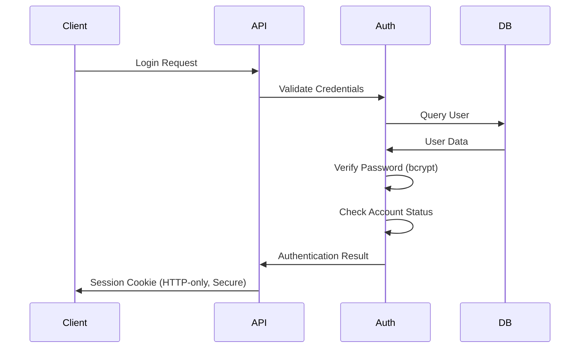
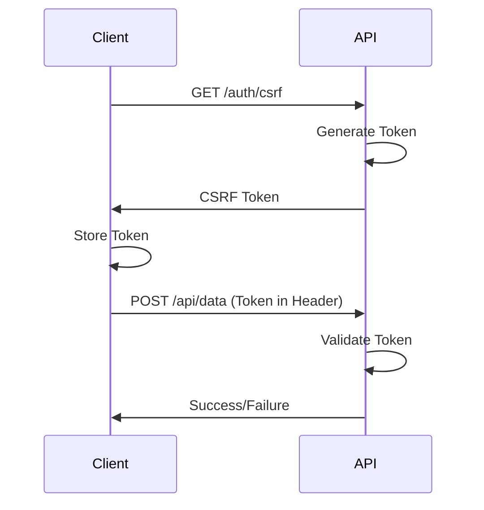

# Security Documentation

## Angular + NestJS Authentication System - Security Guide

This document provides comprehensive security documentation for the authentication system, covering implemented security features, best practices, and security considerations.

---

## Table of Contents

- [Security Overview](#security-overview)
- [Authentication Security](#authentication-security)
- [Session Management Security](#session-management-security)
- [CSRF Protection](#csrf-protection)
- [XSS Protection](#xss-protection)
- [Input Validation & Sanitization](#input-validation--sanitization)
- [Rate Limiting](#rate-limiting)
- [Security Headers](#security-headers)
- [CORS Configuration](#cors-configuration)
- [Password Security](#password-security)
- [Database Security](#database-security)
- [Logging & Monitoring](#logging--monitoring)
- [Security Best Practices](#security-best-practices)
- [Security Checklist](#security-checklist)
- [Incident Response](#incident-response)

---

## Security Overview

### Security Architecture

```
┌─────────────────────────────────────────────────────────┐
│  Security Layers                                        │
├─────────────────────────────────────────────────────────┤
│  1. Network Layer (HTTPS/TLS)                          │
│  2. Application Layer (Helmet, CORS)                   │
│  3. Authentication Layer (Passport, Sessions)          │
│  4. Authorization Layer (Guards, Roles)                │
│  5. Data Layer (Validation, Sanitization)              │
│  6. Storage Layer (Encryption, Hashing)                │
└─────────────────────────────────────────────────────────┘
```

### Security Principles

1. **Defense in Depth**: Multiple layers of security
2. **Least Privilege**: Minimal access rights
3. **Fail Secure**: Secure defaults, explicit permissions
4. **Complete Mediation**: Check every access
5. **Open Design**: Security through design, not obscurity

---

## Authentication Security

### Password-Based Authentication

#### Implementation
```typescript
// backend/src/auth/strategies/local.strategy.ts
@Injectable()
export class LocalStrategy extends PassportStrategy(Strategy) {
  async validate(username: string, password: string): Promise<any> {
    const user = await this.authService.validateUser(username, password);
    if (!user) {
      throw new UnauthorizedException('Invalid credentials');
    }
    return user;
  }
}
```

#### Security Features

**1. Password Hashing (bcrypt)**
```typescript
// Hashing with salt rounds
const hashedPassword = await bcrypt.hash(password, 12);

// Verification
const isMatch = await bcrypt.compare(plainPassword, hashedPassword);
```

**Benefits:**
- ✅ One-way hashing (cannot be reversed)
- ✅ Unique salt per password
- ✅ Configurable work factor (12 rounds)
- ✅ Resistant to rainbow table attacks
- ✅ Slow by design (prevents brute force)

**2. Password Requirements**
```typescript
@IsStrongPassword({
  minLength: 8,
  minLowercase: 1,
  minUppercase: 1,
  minNumbers: 1,
  minSymbols: 1,
})
password: string;
```

**Enforced Rules:**
- Minimum 8 characters
- At least 1 uppercase letter
- At least 1 lowercase letter
- At least 1 number
- At least 1 special character

**3. Account Lockout**
- 5 failed attempts → 15-minute lockout
- Prevents brute force attacks
- Automatic unlock after cooldown
- Logged for security monitoring

### Authentication Flow Security



---

## Session Management Security

### Session Configuration

```typescript
// backend/src/config/session.config.ts
session({
  secret: process.env.SESSION_SECRET, // 64+ char random string
  name: 'sessionId',                  // Custom name (not 'connect.sid')
  resave: false,                      // Don't save unchanged sessions
  saveUninitialized: false,           // Don't create empty sessions
  rolling: true,                      // Extend session on activity
  cookie: {
    httpOnly: true,                   // Prevent XSS access
    secure: true,                     // HTTPS only (production)
    sameSite: 'strict',               // CSRF protection
    maxAge: 1800000,                  // 30 minutes
    domain: undefined,                // Same domain only
    path: '/',                        // All paths
  },
  store: new RedisStore({             // Secure storage
    client: redisClient,
    prefix: 'sess:',
    ttl: 1800,
  }),
})
```

### Session Security Features

#### 1. HTTP-Only Cookies
**Protection:** XSS attacks cannot access session cookies

```javascript
// ❌ This will fail (HTTP-only cookie)
document.cookie; // Cannot access sessionId
```

#### 2. Secure Flag
**Protection:** Cookies only sent over HTTPS

```http
Set-Cookie: sessionId=abc123; Secure; HttpOnly
```

#### 3. SameSite Attribute
**Protection:** CSRF attacks prevented

```http
Set-Cookie: sessionId=abc123; SameSite=Strict
```

**Options:**
- `Strict`: Never sent cross-site
- `Lax`: Sent on top-level navigation
- `None`: Sent everywhere (requires Secure)

#### 4. Session Expiration
**Protection:** Limits exposure window

- **Idle Timeout**: 30 minutes of inactivity
- **Absolute Timeout**: 24 hours maximum
- **Rolling Sessions**: Extends on activity
- **Automatic Cleanup**: Redis TTL

#### 5. Session Regeneration
**Protection:** Prevents session fixation

```typescript
// After login
req.session.regenerate((err) => {
  // New session ID issued
  req.session.userId = user.id;
});
```

### Redis Session Storage

**Security Benefits:**
- ✅ Centralized session management
- ✅ Automatic expiration (TTL)
- ✅ Fast session validation
- ✅ Scalable across servers
- ✅ Memory-only storage (no disk)

**Configuration:**
```typescript
{
  host: process.env.REDIS_HOST,
  port: 6379,
  password: process.env.REDIS_PASSWORD, // Required in production
  db: 0,
  keyPrefix: 'sess:',
  ttl: 1800,
}
```

---

## CSRF Protection

### CSRF Attack Vector

**What is CSRF?**
Cross-Site Request Forgery tricks authenticated users into performing unwanted actions.

**Attack Example:**
```html
<!-- Malicious site -->

<!-- Executes with user's session! -->
```

### CSRF Protection Implementation

#### 1. Double Submit Cookie Pattern

```typescript
// backend/src/auth/csrf.service.ts
generateCsrfToken(): string {
  return randomBytes(32).toString('hex');
}

validateCsrfToken(token: string, sessionToken: string): boolean {
  return token === sessionToken;
}
```

#### 2. CSRF Guard

```typescript
// backend/src/auth/guards/csrf.guard.ts
@Injectable()
export class CsrfGuard implements CanActivate {
  canActivate(context: ExecutionContext): boolean {
    const request = context.switchToHttp().getRequest();
    const csrfToken = request.headers['x-csrf-token'];
    const sessionToken = request.session.csrfToken;
    
    if (!csrfToken || csrfToken !== sessionToken) {
      throw new ForbiddenException('Invalid CSRF token');
    }
    
    return true;
  }
}
```

#### 3. Frontend Integration

```typescript
// frontend/src/app/core/interceptors/csrf.interceptor.ts
intercept(req: HttpRequest<any>, next: HttpHandler) {
  const csrfToken = this.csrfService.getToken();
  
  if (this.isStateChanging(req.method)) {
    req = req.clone({
      setHeaders: {
        'X-CSRF-Token': csrfToken
      }
    });
  }
  
  return next.handle(req);
}
```

### CSRF Protection Flow



---

## XSS Protection

### Cross-Site Scripting Prevention

#### 1. Content Security Policy (CSP)

```typescript
// backend/src/main.ts
helmet({
  contentSecurityPolicy: {
    directives: {
      defaultSrc: ["'self'"],
      scriptSrc: ["'self'"],
      styleSrc: ["'self'", "'unsafe-inline'"],
      imgSrc: ["'self'", 'data:', 'https:'],
      connectSrc: ["'self'"],
      fontSrc: ["'self'"],
      objectSrc: ["'none'"],
      mediaSrc: ["'self'"],
      frameSrc: ["'none'"],
    },
  },
})
```

**Protection:**
- ✅ Blocks inline scripts
- ✅ Restricts resource origins
- ✅ Prevents code injection
- ✅ Mitigates XSS attacks

#### 2. Input Sanitization

```typescript
// backend/src/common/pipes/sanitize.pipe.ts
@Injectable()
export class SanitizePipe implements PipeTransform {
  transform(value: any) {
    if (typeof value === 'string') {
      return sanitizeHtml(value, {
        allowedTags: [],
        allowedAttributes: {},
      });
    }
    return value;
  }
}
```

**Sanitization Rules:**
- Strip all HTML tags
- Remove JavaScript
- Encode special characters
- Validate data types

#### 3. Output Encoding

```typescript
// Angular automatically encodes output
<div>{{ userInput }}</div>  <!-- Safe: Auto-encoded -->
<div [innerHTML]="userInput"></div>  <!-- Unsafe: Use DomSanitizer -->
```

#### 4. HTTP-Only Cookies

```typescript
cookie: {
  httpOnly: true,  // JavaScript cannot access
}
```

**Protection:**
- ✅ Prevents cookie theft via XSS
- ✅ Session cookies inaccessible to scripts
- ✅ Reduces attack surface

---

## Input Validation & Sanitization

### Validation Strategy

#### 1. DTO Validation (class-validator)

```typescript
// backend/src/auth/dto/login.dto.ts
export class LoginDto {
  @IsString()
  @IsNotEmpty()
  @MinLength(3)
  @MaxLength(50)
  @Matches(/^[a-zA-Z0-9_]+$/)
  username: string;

  @IsString()
  @IsNotEmpty()
  @MinLength(8)
  @MaxLength(100)
  password: string;
}
```

#### 2. Global Validation Pipe

```typescript
// backend/src/main.ts
app.useGlobalPipes(
  new ValidationPipe({
    whitelist: true,              // Strip unknown properties
    forbidNonWhitelisted: true,   // Reject unknown properties
    transform: true,              // Auto-transform types
    disableErrorMessages: false,  // Show errors in dev
  }),
);
```

#### 3. Sanitization Pipeline

```
Input → Validation → Sanitization → Processing → Output
  ↓         ↓            ↓             ↓          ↓
Type     Format       Clean        Business    Encode
Check    Check        Data         Logic       Output
```

### SQL Injection Prevention

**Using TypeORM (Parameterized Queries):**
```typescript
// ✅ Safe: Parameterized
await this.userRepository.findOne({
  where: { username: username }
});

// ❌ Unsafe: String concatenation
await this.userRepository.query(
  `SELECT * FROM users WHERE username = '${username}'`
);
```

**Protection:**
- ✅ ORM handles escaping
- ✅ Prepared statements
- ✅ No raw SQL concatenation
- ✅ Type-safe queries

---

## Rate Limiting

### Rate Limiting Configuration

```typescript
// backend/src/config/throttler.config.ts
ThrottlerModule.forRoot([
  {
    name: 'short',
    ttl: 1000,      // 1 second
    limit: 3,       // 3 requests
  },
  {
    name: 'medium',
    ttl: 10000,     // 10 seconds
    limit: 20,      // 20 requests
  },
  {
    name: 'long',
    ttl: 60000,     // 1 minute
    limit: 100,     // 100 requests
  },
])
```

### Endpoint-Specific Limits

```typescript
// Authentication endpoints (strict)
@Throttle({ short: { limit: 5, ttl: 900000 } }) // 5 per 15 min
@Post('login')
async login() { }

// General API (moderate)
@Throttle({ long: { limit: 100, ttl: 900000 } }) // 100 per 15 min
@Get('users')
async getUsers() { }
```

### Rate Limiting Benefits

**Protection Against:**
- ✅ Brute force attacks
- ✅ Credential stuffing
- ✅ DoS attacks
- ✅ API abuse
- ✅ Resource exhaustion

**User Experience:**
- Legitimate users rarely affected
- Clear error messages
- Retry-After header provided
- Automatic cooldown

---

## Security Headers

### Helmet Configuration

```typescript
// backend/src/main.ts
app.use(helmet({
  contentSecurityPolicy: { /* CSP rules */ },
  crossOriginEmbedderPolicy: true,
  crossOriginOpenerPolicy: true,
  crossOriginResourcePolicy: true,
  dnsPrefetchControl: true,
  frameguard: { action: 'deny' },
  hidePoweredBy: true,
  hsts: {
    maxAge: 31536000,
    includeSubDomains: true,
    preload: true,
  },
  ieNoOpen: true,
  noSniff: true,
  originAgentCluster: true,
  permittedCrossDomainPolicies: false,
  referrerPolicy: { policy: 'strict-origin-when-cross-origin' },
  xssFilter: true,
}));
```

### Security Headers Explained

| Header | Purpose | Value |
|--------|---------|-------|
| `Content-Security-Policy` | XSS protection | Restrict resource origins |
| `Strict-Transport-Security` | Force HTTPS | max-age=31536000 |
| `X-Frame-Options` | Clickjacking protection | DENY |
| `X-Content-Type-Options` | MIME sniffing protection | nosniff |
| `X-XSS-Protection` | XSS filter | 1; mode=block |
| `Referrer-Policy` | Referrer control | strict-origin-when-cross-origin |
| `Permissions-Policy` | Feature control | Restrict APIs |

---

## CORS Configuration

### Development vs Production

**Development (Permissive):**
```typescript
{
  origin: 'http://localhost:4200',
  credentials: true,
  methods: ['GET', 'POST', 'PUT', 'DELETE', 'OPTIONS'],
  allowedHeaders: ['Content-Type', 'Authorization', 'X-CSRF-Token'],
  exposedHeaders: ['Set-Cookie'],
}
```

**Production (Strict):**
```typescript
{
  origin: (origin, callback) => {
    const allowedOrigins = [
      'https://yourdomain.com',
      'https://www.yourdomain.com',
    ];
    if (allowedOrigins.includes(origin)) {
      callback(null, true);
    } else {
      callback(new Error('Not allowed by CORS'));
    }
  },
  credentials: true,
  methods: ['GET', 'POST', 'PUT', 'DELETE'],
  allowedHeaders: ['Content-Type', 'X-CSRF-Token'],
  exposedHeaders: [],
}
```

### CORS Security Rules

**✅ DO:**
- Whitelist specific origins
- Enable credentials carefully
- Restrict methods
- Limit exposed headers
- Use HTTPS in production

**❌ DON'T:**
- Use wildcard (*) with credentials
- Allow all origins in production
- Expose sensitive headers
- Allow unnecessary methods
- Trust client-provided Origin header

---

## Password Security

### Password Storage

**Never Store Plain Text:**
```typescript
// ❌ NEVER DO THIS
user.password = plainPassword;

// ✅ Always hash
user.password = await bcrypt.hash(plainPassword, 12);
```

### Password Hashing (bcrypt)

**Why bcrypt?**
- Adaptive: Can increase work factor
- Salted: Unique salt per password
- Slow: Intentionally slow (prevents brute force)
- Proven: Battle-tested algorithm

**Work Factor:**
```typescript
const rounds = 12; // 2^12 iterations
// Rounds 10: ~10 hashes/sec
// Rounds 12: ~2-3 hashes/sec (recommended)
// Rounds 14: ~0.5 hashes/sec (very secure)
```

### Password Reset Security

**Secure Reset Flow:**
1. User requests reset
2. Generate secure token (32+ bytes)
3. Store hashed token with expiry (1 hour)
4. Send token via email
5. Validate token on reset
6. Invalidate token after use
7. Force re-login after reset

---

## Database Security

### Connection Security

```typescript
// backend/src/config/database.config.ts
{
  type: 'postgres',
  host: process.env.DB_HOST,
  port: parseInt(process.env.DB_PORT),
  username: process.env.DB_USER,
  password: process.env.DB_PASSWORD,
  database: process.env.DB_NAME,
  ssl: process.env.NODE_ENV === 'production' ? {
    rejectUnauthorized: true,
  } : false,
  synchronize: false, // Never true in production
  logging: process.env.NODE_ENV === 'development',
}
```

### Database Security Best Practices

**✅ DO:**
- Use environment variables for credentials
- Enable SSL/TLS in production
- Use least privilege database user
- Disable synchronize in production
- Regular backups
- Encrypt sensitive data at rest

**❌ DON'T:**
- Hardcode credentials
- Use root/admin user
- Enable synchronize in production
- Store sensitive data unencrypted
- Expose database directly to internet

---

## Logging & Monitoring

### Security Logging

```typescript
// backend/src/config/logger.config.ts
transports: [
  new winston.transports.DailyRotateFile({
    filename: 'logs/security-%DATE%.log',
    datePattern: 'YYYY-MM-DD',
    maxSize: '20m',
    maxFiles: '90d', // 90 days retention
    level: 'warn',
  }),
]
```

### Events to Log

**Authentication Events:**
- ✅ Login attempts (success/failure)
- ✅ Logout events
- ✅ Password changes
- ✅ Account lockouts
- ✅ Session creation/destruction

**Security Events:**
- ✅ CSRF token validation failures
- ✅ Rate limit violations
- ✅ Invalid input attempts
- ✅ Authorization failures
- ✅ Suspicious patterns

**System Events:**
- ✅ Application start/stop
- ✅ Configuration changes
- ✅ Database connection issues
- ✅ External service failures

### Log Sanitization

```typescript
// ❌ DON'T log sensitive data
logger.error('Login failed', { password: user.password });

// ✅ DO sanitize logs
logger.error('Login failed', { 
  username: user.username,
  ip: req.ip,
  timestamp: new Date()
});
```

---

## Security Best Practices

### Development

1. **Never commit secrets**
   - Use .gitignore for .env files
   - Use environment variables
   - Rotate secrets regularly

2. **Keep dependencies updated**
   ```bash
   npm audit
   npm audit fix
   npm outdated
   ```

3. **Use security linters**
   ```bash
   npm install --save-dev eslint-plugin-security
   ```

### Production

1. **Use HTTPS everywhere**
   - SSL/TLS certificates
   - HSTS headers
   - Secure cookies

2. **Implement monitoring**
   - Error tracking (Sentry)
   - Performance monitoring
   - Security alerts

3. **Regular security audits**
   - Penetration testing
   - Code reviews
   - Dependency audits

4. **Backup strategy**
   - Daily automated backups
   - Test restore procedures
   - Offsite storage

---

## Security Checklist

### Pre-Deployment

- [ ] All secrets in environment variables
- [ ] Strong SESSION_SECRET (64+ characters)
- [ ] HTTPS enabled
- [ ] Secure cookies enabled
- [ ] CORS properly configured
- [ ] Rate limiting enabled
- [ ] Input validation on all endpoints
- [ ] CSRF protection enabled
- [ ] Security headers configured
- [ ] Database credentials secured
- [ ] Logging configured
- [ ] Error messages sanitized
- [ ] Dependencies updated
- [ ] Security audit completed

### Post-Deployment

- [ ] SSL/TLS certificate valid
- [ ] HTTPS redirect working
- [ ] Security headers present
- [ ] CORS working correctly
- [ ] Rate limiting functional
- [ ] Logging operational
- [ ] Monitoring configured
- [ ] Backup system active
- [ ] Incident response plan ready

---

## Incident Response

### Security Incident Procedure

1. **Detect**
   - Monitor logs
   - Alert on anomalies
   - User reports

2. **Assess**
   - Determine severity
   - Identify affected systems
   - Estimate impact

3. **Contain**
   - Isolate affected systems
   - Block malicious IPs
   - Revoke compromised credentials

4. **Eradicate**
   - Remove malicious code
   - Patch vulnerabilities
   - Update security measures

5. **Recover**
   - Restore from backups
   - Verify system integrity
   - Resume normal operations

6. **Learn**
   - Document incident
   - Update procedures
   - Improve defenses

### Contact Information

**Security Team:**
- Email: security@yourdomain.com
- Emergency: +1-XXX-XXX-XXXX
- PGP Key: [Link to public key]

---

**Made with Bob**