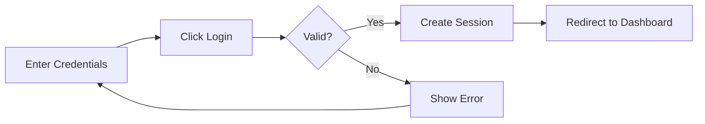

# User Guide

## Angular + NestJS Authentication System

Welcome to the User Guide for the Angular + NestJS Authentication System. This guide will help you understand and use the application effectively.

---

## Table of Contents

- [Getting Started](#getting-started)
- [User Registration](#user-registration)
- [User Login](#user-login)
- [Dashboard](#dashboard)
- [Session Management](#session-management)
- [Security Features](#security-features)
- [Troubleshooting](#troubleshooting)
- [FAQ](#faq)

---

## Getting Started

### Prerequisites

Before using the application, ensure you have:
- A modern web browser (Chrome, Firefox, Safari, Edge)
- JavaScript enabled
- Cookies enabled
- Internet connection

### Accessing the Application

**Development:**
- URL: `http://localhost:4200`

**Production:**
- URL: `https://yourdomain.com`

---

## User Registration

### Creating a New Account

1. **Navigate to Registration Page**
   - Click "Sign Up" or "Register" button
   - Or visit `/register` directly

2. **Fill in Registration Form**
   ```
   Username: [Enter username]
   Email: [Enter email]
   Password: [Enter password]
   Confirm Password: [Re-enter password]
   ```

3. **Username Requirements**
   - 3-50 characters
   - Letters, numbers, and underscores only
   - Must be unique

4. **Email Requirements**
   - Valid email format
   - Must be unique
   - Used for account recovery

5. **Password Requirements**
   - Minimum 8 characters
   - At least one uppercase letter (A-Z)
   - At least one lowercase letter (a-z)
   - At least one number (0-9)
   - At least one special character (!@#$%^&*)

6. **Submit Registration**
   - Click "Register" button
   - Wait for confirmation
   - You'll be redirected to login page

### Registration Example

```
✅ Good Password: SecurePass123!@#
❌ Bad Password: password (too simple)
❌ Bad Password: 12345678 (no letters)
❌ Bad Password: Password (no numbers/special chars)
```

---

## User Login

### Logging In

1. **Navigate to Login Page**
   - Visit the home page
   - Or go to `/login` directly

2. **Enter Credentials**
   ```
   Username: [Your username]
   Password: [Your password]
   ```

3. **Optional: Remember Me**
   - Check "Remember Me" for extended session
   - Session lasts 30 days instead of 30 minutes

4. **Click Login**
   - System validates credentials
   - Creates secure session
   - Redirects to dashboard

### Login Process



### Common Login Issues

**Issue: "Invalid credentials"**
- Check username spelling
- Verify password (case-sensitive)
- Ensure Caps Lock is off

**Issue: "Too many login attempts"**
- Wait 15 minutes
- Rate limiting protects your account
- Try again after cooldown period

**Issue: "Session expired"**
- Your previous session timed out
- Simply log in again
- Consider using "Remember Me"

---

## Dashboard

### Dashboard Overview

After logging in, you'll see the dashboard with:

1. **Welcome Message**
   - Displays your username
   - Shows last login time

2. **User Information**
   - Username
   - Email address
   - Account creation date

3. **Session Status**
   - Current session duration
   - Time until session expires
   - Session warning notifications

4. **Navigation Menu**
   - Profile settings
   - Account management
   - Logout button

### Dashboard Features

#### Session Timer
- Shows remaining session time
- Updates in real-time
- Warns before expiration

#### Activity Indicator
- Green dot: Active session
- Yellow dot: Session expiring soon
- Red dot: Session expired

#### Quick Actions
- Update profile
- Change password
- View activity log
- Logout

---

## Session Management

### Understanding Sessions

**What is a Session?**
- A secure connection between you and the server
- Maintains your logged-in state
- Automatically expires after inactivity

**Session Duration:**
- Default: 30 minutes of inactivity
- With "Remember Me": 30 days
- Extends with each activity

### Session Features

#### 1. Automatic Session Extension
Your session automatically extends when you:
- Click anywhere in the application
- Navigate between pages
- Interact with forms
- Make API requests

#### 2. Session Warning
You'll receive a warning when:
- 2 minutes remain before expiration
- A modal dialog appears
- Options to extend or logout

**Warning Dialog:**
```
⚠️ Session Expiring Soon

Your session will expire in 2 minutes.

[Extend Session]  [Logout Now]
```

#### 3. Cross-Tab Synchronization
- Login in one tab → All tabs logged in
- Logout in one tab → All tabs logged out
- Session extends across all tabs
- Seamless multi-tab experience

**Example:**
```
Tab 1: Login → Session created
Tab 2: Automatically logged in
Tab 1: Logout → Tab 2 also logs out
```

#### 4. Session Keepalive
- Automatic background requests
- Keeps session alive during activity
- Prevents unexpected logouts
- Configurable interval

### Managing Your Session

#### Extend Session
1. Click anywhere in the application
2. Or click "Extend Session" in warning dialog
3. Session timer resets to 30 minutes

#### Manual Logout
1. Click "Logout" button in navigation
2. Or click "Logout Now" in warning dialog
3. Session immediately terminated
4. Redirected to login page

#### Automatic Logout
Occurs when:
- Session expires (30 minutes inactivity)
- You close all browser tabs (optional)
- Server restarts (rare)
- Security event detected

---

## Security Features

### Built-in Security

#### 1. Password Security
- Passwords are hashed (bcrypt)
- Never stored in plain text
- Cannot be recovered (only reset)
- Strong password requirements enforced

#### 2. Session Security
- HTTP-only cookies (XSS protection)
- Secure flag in production (HTTPS only)
- SameSite attribute (CSRF protection)
- Automatic expiration

#### 3. CSRF Protection
- All state-changing operations protected
- Automatic token management
- Transparent to users
- Prevents cross-site attacks

#### 4. Rate Limiting
- Prevents brute force attacks
- 5 login attempts per 15 minutes
- Automatic cooldown period
- Protects all users

#### 5. Input Validation
- All inputs sanitized
- XSS attack prevention
- SQL injection protection
- Malicious input blocked

### Security Best Practices

#### For Users

**✅ DO:**
- Use strong, unique passwords
- Log out on shared computers
- Keep browser updated
- Enable two-factor authentication (if available)
- Report suspicious activity

**❌ DON'T:**
- Share your password
- Use public Wi-Fi without VPN
- Save passwords in browser on shared computers
- Click suspicious links
- Ignore security warnings

#### Password Tips

**Creating Strong Passwords:**
```
✅ Good: MyD0g&CatAre!Best2023
✅ Good: Tr@vel#Paris$2024!
✅ Good: C0ffee&Code!Morning

❌ Bad: password123
❌ Bad: qwerty
❌ Bad: 12345678
```

**Password Manager:**
- Consider using a password manager
- Generates strong passwords
- Securely stores credentials
- Syncs across devices

---

## Troubleshooting

### Common Issues

#### Cannot Login

**Symptom:** Login button doesn't work or shows error

**Solutions:**
1. Check credentials are correct
2. Ensure Caps Lock is off
3. Clear browser cache and cookies
4. Try different browser
5. Check if cookies are enabled
6. Wait if rate limited (15 minutes)

#### Session Keeps Expiring

**Symptom:** Logged out frequently

**Solutions:**
1. Enable "Remember Me" option
2. Check for browser extensions blocking cookies
3. Ensure cookies are enabled
4. Don't use private/incognito mode
5. Check browser cookie settings

#### Page Not Loading

**Symptom:** Blank page or loading forever

**Solutions:**
1. Refresh the page (F5 or Ctrl+R)
2. Clear browser cache
3. Check internet connection
4. Try different browser
5. Check browser console for errors

#### Cross-Tab Issues

**Symptom:** Tabs not synchronizing

**Solutions:**
1. Ensure all tabs are from same domain
2. Check browser supports Broadcast Channel API
3. Refresh all tabs
4. Close and reopen tabs
5. Clear browser storage

### Error Messages

#### "Invalid credentials"
- Username or password incorrect
- Check spelling and case
- Reset password if forgotten

#### "Session expired"
- Your session timed out
- Log in again
- Consider using "Remember Me"

#### "Too many requests"
- Rate limit exceeded
- Wait 15 minutes
- Try again later

#### "CSRF token invalid"
- Security token expired
- Refresh the page
- Try operation again

#### "Network error"
- Check internet connection
- Server might be down
- Try again in a few minutes

### Getting Help

**If issues persist:**

1. **Check Documentation**
   - Review this User Guide
   - Check API Documentation
   - Read Troubleshooting Guide

2. **Contact Support**
   - Email: support@yourdomain.com
   - Include error messages
   - Describe steps to reproduce
   - Mention browser and OS

3. **Report Bugs**
   - GitHub Issues
   - Include screenshots
   - Provide browser console logs
   - Describe expected vs actual behavior

---

## FAQ

### General Questions

**Q: Is my data secure?**  
A: Yes. We use industry-standard security practices including password hashing, HTTPS encryption, CSRF protection, and secure session management.

**Q: How long does my session last?**  
A: 30 minutes of inactivity by default. With "Remember Me" enabled, sessions last 30 days.

**Q: Can I use the app on mobile?**  
A: Yes. The application is responsive and works on mobile browsers.

**Q: Do I need to install anything?**  
A: No. It's a web application that runs in your browser.

### Account Questions

**Q: How do I reset my password?**  
A: Click "Forgot Password" on the login page and follow the instructions sent to your email.

**Q: Can I change my username?**  
A: Contact support to change your username. Email changes can be done in profile settings.

**Q: How do I delete my account?**  
A: Go to Account Settings → Delete Account, or contact support.

**Q: What happens to my data if I delete my account?**  
A: All your data is permanently deleted and cannot be recovered.

### Security Questions

**Q: Why do I need a strong password?**  
A: Strong passwords protect your account from unauthorized access and brute force attacks.

**Q: What is CSRF protection?**  
A: CSRF (Cross-Site Request Forgery) protection prevents malicious websites from performing actions on your behalf.

**Q: Why does my session expire?**  
A: Session expiration is a security feature that protects your account if you forget to log out.

**Q: Is it safe to use "Remember Me"?**  
A: Yes, on your personal devices. Don't use it on shared or public computers.

### Technical Questions

**Q: Which browsers are supported?**  
A: Chrome, Firefox, Safari, and Edge (latest versions).

**Q: Why do I need cookies enabled?**  
A: Cookies are required for session management and authentication.

**Q: What is cross-tab synchronization?**  
A: It keeps all your browser tabs in sync. Login in one tab logs you in everywhere.

**Q: Can I use the app offline?**  
A: No. An internet connection is required for authentication and data access.

---

## Keyboard Shortcuts

| Shortcut | Action |
|----------|--------|
| `Ctrl + L` | Focus login form |
| `Enter` | Submit form |
| `Esc` | Close modal dialogs |
| `Ctrl + /` | Show keyboard shortcuts |

---

## Browser Compatibility

| Browser | Minimum Version | Status |
|---------|----------------|--------|
| Chrome | 90+ | ✅ Fully Supported |
| Firefox | 88+ | ✅ Fully Supported |
| Safari | 14+ | ✅ Fully Supported |
| Edge | 90+ | ✅ Fully Supported |
| IE 11 | - | ❌ Not Supported |

---

## Accessibility

The application follows WCAG 2.1 Level AA guidelines:

- ✅ Keyboard navigation
- ✅ Screen reader support
- ✅ High contrast mode
- ✅ Resizable text
- ✅ Focus indicators
- ✅ ARIA labels

---

## Updates and Maintenance

**Scheduled Maintenance:**
- Usually performed during off-peak hours
- Advance notice provided
- Minimal downtime expected

**Feature Updates:**
- Regular feature releases
- Security patches applied promptly
- Changelog available

**Notifications:**
- In-app notifications for updates
- Email notifications for important changes
- Maintenance announcements

---

## Support

**Need Help?**

- 📧 Email: support@yourdomain.com
- 📚 Documentation: [docs.yourdomain.com](https://docs.yourdomain.com)
- 🐛 Report Issues: [github.com/yourrepo/issues](https://github.com/yourrepo/issues)
- 💬 Community: [community.yourdomain.com](https://community.yourdomain.com)

**Support Hours:**
- Monday - Friday: 9 AM - 5 PM EST
- Response time: Within 24 hours
- Emergency support: Available for critical issues

---

**Made with Bob**